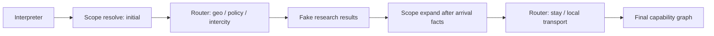

# M4.2：差旅语义与能力路由

> 文档状态：Frozen v1.2，可在 M4.1 验收后编写阶段 Plan  
> 前置阶段：M4.1 商务差旅评测基线已验收  
> 后续阶段：M4.3 差旅最小纵向切片  
> 本阶段性质：语义合同与控制平面迁移，不接入真实差旅供应商
> 人工验收依赖：总 Spec“阶段人工收口”原则与 `ACC-INFRA-1` 通用接口合同
> 验收合同修订：v1.2，保留阶段人工语义收口要求，解除对 ACC-INFRA-1 未定型实现细节的提前绑定

## 1. 阶段定位

M4.2 修复 M4 验收暴露的核心语义断层：Interpreter 只提取基础旅行字段，而 Router 把 `PLAN` 默认映射为 `geo + transport`，导致 M4 没有机会研究政策、住宿和市内交通。

本阶段建立从“用户事实”到“规划范围”再到“能力与任务依赖”的唯一合同：

```text
RequestInterpreter
→ typed facts / constraints / unknowns
→ BusinessTripScopeResolver
→ frozen BusinessTripScope
→ InteractionRouter
→ required capabilities + reasons
→ Dynamic Task Graph
```

M4.2 只证明系统能够正确决定“需要查什么、为什么查、先查什么”。真实政策 PDF、航班、酒店、市内交通检索和最终方案属于 M4.3。

求职版业务边界固定为中国大陆境内、单人、单出发城市、单目的城市和一个首要会议目标。国际/港澳台、明确多人、多城市和显式多会议请求统一返回 `UNSUPPORTED_SCOPE`，不得为展示能力而扩大合同。

去程只支持一个直达航班或直达铁路候选，不规划联程、中转、经停组合或跨供应商换乘；这类请求统一返回 `UNSUPPORTED_SCOPE`。机场/车站至酒店或会场的市内路线不属于“城际中转”，仍由 `local_transport` 覆盖。

## 2. 阶段目标

- 冻结 `MeetingRequirement`、`BusinessTripScope`、能力枚举和范围判定原因合同；
- 让 Interpreter 提取会议事实、差旅事实、显式要求、否定和未知项；
- 引入确定性 `BusinessTripScopeResolver`，禁止 Router 自行猜测业务范围；
- 将 Router 从旧 `geo + transport` 默认规则迁移到冻结范围映射；
- 支持“初始范围判定 → 去程结果 → 候选级会前住宿与市内交通扩展”的两阶段任务图；
- 使用 M4.1 冻结数据集生成 M4.2-current 和与 M4-before 的差异报告；
- 使用 Fake/Fixture 验证成功、澄清、失败和禁止能力分支。

## 3. 明确不做

- 不实现 `PolicyKnowledgePort`、PDF 解析或向量 RAG；
- 不调用真实航班、铁路、酒店、地图供应商；
- 不要求 Composer 生成最终 meeting-arrival-ready 行程；
- 不实现完整 G0～G5、Critic 或 Repair；
- 不规划返程，不引入景点/活动能力；
- 不实现预订、付款、取消或改签；
- 不为通过评测修改 M4.1 Golden Oracle；
- 不在 M4.2 实现期改写 M4.1 评测资产；本阶段 Plan 在 M4.1 验收后独立编写。

## 4. 核心职责边界

### 4.1 RequestInterpreter

Interpreter 只负责从用户输入提取：

- `origin`、`destination`、`traveler_count`；
- 首场会议开始时间、可选结束时间、地点和时区；
- 用户给出的 arrival buffer；
- 预算、酒店和交通偏好；
- 是否明确要求返程；
- 明确否定项和仍未知字段；
- `mode` 与置信度。

Interpreter 不决定酒店夜数，不直接输出工具清单，不把“通常如此”写成用户事实。

### 4.2 BusinessTripScopeResolver

ScopeResolver 是确定性领域服务，输入为类型化事实、约束和受控配置，输出冻结的 `BusinessTripScope`。它负责：

- 判定 `meeting_arrival_ready` 规划边界；
- 区分 required、conditional、excluded 与 unknown 范围；
- 为每个能力输出机器可读 reason；
- 判断哪些未知项阻断规划并触发 G1；
- 在去程候选出现后计算每个候选是否需要一晚会前住宿及其本地移动段；
- 明确返程与景点不在 MVP 主链路。

ScopeResolver 不调用 LLM、Agent 或外部工具。

### 4.3 InteractionRouter

Router 只消费已经冻结的范围：

```text
scope requirement
→ capability
```

Router 不得根据原始文本、`PLAN` 模式或 `activity` 类别额外推断能力。每个能力必须携带来源 requirement 和 reason。

### 4.4 Orchestrator / Task Graph

Orchestrator 根据 Router 输出创建和扩展 Task Graph。它不重新解释业务语义，也不把缺失能力静默删除。

## 5. 类型化合同

### 5.1 MeetingRequirement

至少包含：

```text
meeting_id
location
city
timezone
starts_at
ends_at
arrival_buffer
source
confidence
```

`ends_at` 在首版为可选字段，不是 G1 blocker，也不参与 meeting-arrival-ready 计算。首版只支持一个明确的首要会议到达目标；用户显式给出两个及以上会议时统一返回 `UNSUPPORTED_SCOPE`，不得任意挑选或静默忽略后续会议。一个具有跨天开始/结束时间的连续会议仍视为一个会议，但只使用其开始时间计算到达目标。

### 5.2 BusinessTripScope

至少包含：

```text
planning_horizon = meeting_arrival_ready
planning_end = first_meeting.required_arrival_at
policy_requirement
intercity_requirement
lodging_requirement
local_transport_requirement
return_scope
excluded_capabilities
unknowns
blocking_unknowns
resolution_reasons
scope_version
```

范围状态使用显式枚举：

```text
REQUIRED
CONDITIONAL
EXCLUDED
UNKNOWN
```

### 5.3 PreMeetingLodgingRequirement

至少包含：

```text
local_date
city
candidate_id
check_in_date
check_out_date
reason
meeting_id
```

会前住宿以目的地本地日期表达，每个去程候选最多关联一条。该合同属于候选级条件，不得把 `stay` 简化为整个请求统一必选或统一排除。

### 5.4 能力枚举

主链路能力至少区分：

```text
geo
policy
intercity_transport
stay
local_transport
```

`place`、`activity` 和 `return_transport` 不属于首版能力集合。内部候选可继续使用 `TRANSPORT` kind 兼容 M3/M4，但必须增加受控 subtype/segment 字段区分 `intercity` 与 `local`，禁止仅靠自由文本判断。

## 6. G1 规划就绪规则

以下缺失或冲突必须进入 `CLARIFY`，且不得创建外部研究任务：

- origin；
- 会议城市或可解析地点；
- 会议开始时间；
- 会议时区；
- traveler count；
- 用户给出的日期与会议时间存在不可消解冲突。

会议结束时间不是 G1 blocker；首版不规划会议期间住宿或会后安排。

以下不是 G1 blocker：

- 未说明返程；
- 未说明酒店品牌；
- 未说明航司；
- 未说明景点；
- 未给出可由受控系统配置提供的默认 arrival buffer。

默认 arrival buffer 必须有配置版本和 reason，不能由 LLM 临时生成。

有效 arrival buffer 的优先级冻结为“取所有适用最小值中的最大值”：用户显式最小提前量、通用政策最小提前量和 `timing-policy-cn-domestic-v1` 的 30 分钟系统默认共同参与计算；缺失项不参与，实际采用值和来源必须进入 `resolution_reasons`。用户不能用更短要求覆盖政策或系统安全下限。

## 7. 两阶段范围解析与任务图

### 7.1 初始阶段

会议事实冻结后，至少产生：

```text
geo
policy
intercity_transport
```

`stay` 先标记为 `CONDITIONAL`，因为它依赖每个去程候选的本地到达日期和方案形态。`local_transport` 在 meeting-arrival-ready 范围中为 `REQUIRED`，但其具体研究任务必须等待实际到达点、可选酒店选择和会议地点形成可执行 segment 后才能展开。

### 7.2 扩展阶段

获得去程候选后，确定性服务根据以下事实扩展范围：

- 候选到达机场/车站；
- 候选本地到达时间；
- 会议开始时间与 buffer；
- 会议地点；
- 是否为前一日到达并选择过夜。

对会议前一日到达并过夜的候选，生成一条 `PreMeetingLodgingRequirement` 并为该候选启用 `stay`；对会议当日到达且可满足时限的候选，不启用酒店。两类候选可以同时存在。`local_transport` 的 required 状态不因依赖尚未就绪而消失；扩展阶段负责把它具体化为机场/车站—酒店—会场或机场/车站—会场的研究任务。



无可行去程候选时，不得猜测会前住宿；应返回上游研究失败或无候选状态。

## 8. 路由规则

至少满足：

- 商务 `PLAN` + 完整会议要求 → `geo + policy + intercity_transport`；
- 某个候选前一日到达并过夜 → 仅为该候选增加 `stay`；
- 存在机场/车站/酒店/会场移动段 → 增加 `local_transport`；
- 当日可达且无需过夜 → 不增加 `stay`；
- 用户明确不要酒店 → 淘汰需要酒店的候选，但保留独立可行的无住宿候选；全部候选均需酒店时才形成约束冲突或无可行方案；
- 未说明返程 → 不增加返程能力，并冻结 `return_scope=not_planned`；
- 明确要求返程 → 当前阶段返回 `UNSUPPORTED_SCOPE`；
- 景点/活动文本 → 不增加 `place`；
- 仅出现 `activity` → 不影响差旅能力集合；
- 关键会议字段缺失 → `CLARIFY`，能力集合为空。

## 9. 失败语义

至少定义并精确断言：

```text
MISSING_MEETING_REQUIREMENT
AMBIGUOUS_MEETING_REQUIREMENT
CONFLICTING_CONSTRAINT
UNSUPPORTED_SCOPE
SCOPE_RESOLUTION_ERROR
CAPABILITY_MAPPING_ERROR
TASK_DEPENDENCY_ERROR
NO_FEASIBLE_INTERCITY_CANDIDATE
```

错误必须包含 `trace_id`、失败阶段、受影响 requirement/candidate、是否可重试和安全摘要。

## 10. 测试策略

M4.2 严格执行“组件门先于阶段集成门”。组件级失败时可以生成诊断报告，但不得运行或不得通过最终 Stage Integration Gate。

### 10.1 Component Eval

| 组件 | 隔离依赖 | 主要失败模式 | 必须报告的指标 |
|:---|:---|:---|:---|
| Interpreter | 固定 LLM Fixture；另跑 Live LLM | 会议字段遗漏、否定/未知失真、时区错误、过度澄清 | meeting field precision/recall、clarification precision/recall、Schema valid rate |
| ScopeResolver | 直接输入类型化事实与固定候选 | required/conditional/excluded 错判、候选级会前住宿/本地交通范围错误 | scope exact match、candidate pre-meeting lodging exact match、reason coverage |
| Router | 直接输入冻结 BusinessTripScope | 能力漏选、多选、排除能力误启用 | capability exact match、forbidden capability rate |
| Task Graph | 固定 RouterDecision/Fake task result | 节点遗漏、依赖倒置、条件任务提前启动、预算越界 | task dependency accuracy、trajectory validity、step/tool-call count |

组件用例至少包含当日可达、提前一晚、跨午夜、关键字段缺失、冲突、明确返程、景点排除、空候选、预算耗尽和非法 Schema。旧 `PLAN → geo + transport` 行为必须作为明确回归样本被替换。

### 10.2 Stage Integration Eval

阶段集成链固定为：

```text
Interpreter
→ ScopeResolver initial
→ Router
→ Task Graph first wave
→ Fake intercity result
→ ScopeResolver expansion
→ Router/Task Graph second wave
```

至少检查：

- 跨模块 Schema 与 ID 引用一致；
- 关键字段缺失时停在 CLARIFY，研究任务数为零；
- policy、geo、intercity 首波任务齐全；
- stay 只对会前住宿需求非空的候选启用；
- local_transport 作为 required 能力，在依赖事实就绪后具体化；
- 禁止 place/activity/return task；
- 缺少 Fake 配置必须失败，不得默认成功；
- 旧 M0～M4 非差旅合同保持兼容或有明确迁移说明。

集成级必须报告 `pass@1`、固定 k 下的 `pass-all-k`、关键轨迹合法率、第一失败阶段、调用数和延迟。终态正确但轨迹越权或调用排除能力仍判失败。

### 10.3 评测

必须使用 M4.1 冻结数据集，生成：

```text
M4.2-current
M4.2-vs-M4-before
```

不得为 M4.2 删除尚未实现的 M4.3 指标；对于依赖真实检索和方案的指标，应标记 `NOT_APPLICABLE_IN_STAGE`，不能计为通过。

评测报告必须分别输出 Component Scorecards 与 Stage Integration Scorecard，禁止用一个加权总分抵消某个 BLOCKING 组件失败。

## 11. 验收指标

M4.2 的 BLOCKING 指标：

- `mode_accuracy = 100%`；
- `scope_exact_match = 100%`；
- `capability_exact_match = 100%`；
- `task_dependency_accuracy = 100%`；
- G1 澄清字段 precision/recall = 100%；
- 返程披露合同准确率 = 100%；
- 景点/活动误路由率 = 0%；
- 所有范围和能力都有机器可读 reason；
- 无未分类异常、无 fallback、无合成成功。
- BLOCKING 重复运行集 `pass-all-k = 100%`；
- 关键轨迹合法率 = 100%。

Live LLM Eval 允许模型输出波动，但结构化合同、关键字段和能力路由必须达到上述阈值；失败应修复 Prompt/Schema/规则，不能用手工改结果通过。

## 12. 验收标准

- [ ] M4.1 已验收且 baseline artifact 未改变；
- [ ] 核心合同已冻结并通过 Pydantic Schema 测试；
- [ ] Interpreter 不再把能力选择混入事实提取；
- [ ] ScopeResolver 为唯一业务范围决策入口；
- [ ] Router 只映射冻结范围；
- [ ] 两阶段任务依赖通过 Fake 集成测试；
- [ ] Interpreter、ScopeResolver、Router、Task Graph 四类 Component Gate 分别通过；
- [ ] Component 与 Stage Integration 分数卡独立输出；
- [ ] 每个候选的会前住宿需求可由到达事实确定性推导，且最多一晚；
- [ ] 关键字段缺失停在 CLARIFY，不发起研究；
- [ ] 返程和景点边界准确；
- [ ] M4.2-current 与 diff 报告完整，BLOCKING 指标达标；
- [ ] 本阶段实施前，已满足总 Spec“阶段人工收口”原则以及 ACC-INFRA-1 §12 的 M4.2 前置门；
- [ ] 本阶段完成前，必须能够对 Interpreter → `BusinessTripScope` → Router → Task Graph 的实际语义输出进行独立人工核对；具体适配器、案例、命令和 Artifact 形式以 ACC-INFRA-1 的批准版本为准；
- [ ] M0～M4 历史回归通过；
- [ ] 未接入真实政策、航班、酒店或市内交通工具；
- [ ] 未提前实现 M4.3、M5 能力。

## 13. 交付物

- 差旅语义与范围 Pydantic 合同；
- Interpreter 差旅字段与 Prompt/Schema 版本；
- `BusinessTripScopeResolver`；
- Router 能力映射和 reason；
- 两阶段 Task Graph 扩展；
- Fake/Fixture 与故障注入测试；
- M4.2-current、diff 和阶段验收报告。
- M4.2 阶段人工收口所需的实际观察结果、语义核对材料和人工记录；具体形式以 ACC-INFRA-1 的批准版本为准。

具体文件和提交批次由 M4.2 Plan 决定。

## 14. 进入 M4.3 的条件

- M4.2 Spec 与运行时合同已冻结；
- M4.1 数据集上的语义、范围、路由和依赖指标全部达标；
- 真实工具所需输入合同已由能力图明确；
- 没有由 Composer 补写缺失能力的临时逻辑；
- M4.3 的 PDF、供应商字段和 Live 预算决策已关闭。
- M4.2 阶段人工收口状态为 `ACCEPTED`；任何 `BLOCKED`、`REJECTED` 或未完成的人工复核都不能满足此条件。

## 15. 版本记录

| 版本 | 日期 | 变更 |
|:---|:---|:---|
| Draft v0.1 | 2026-08-12 | 从原 M4.1 拆出差旅语义、范围判定、能力路由与两阶段任务依赖。 |
| Draft v0.2 | 2026-08-12 | 增加 Interpreter、ScopeResolver、Router、Task Graph 组件矩阵及阶段集成、轨迹和重复稳定性门。 |
| Draft v0.3 | 2026-08-12 | 同步 `meeting_arrival_ready`：结束时间退出 G1；`stay` 改为去程候选级、最多一晚的会前住宿条件，并允许酒店/无酒店方案并存。 |
| Frozen v1.0 | 2026-08-12 | 按快速求职范围冻结中国大陆境内、单人、单城市对、单会议目标、两阶段范围解析、候选级最多一晚住宿、显式不支持返程/多会议，以及 arrival buffer 的确定性优先级。 |
| Frozen v1.1 | 2026-08-16 | 引用总 Spec“阶段人工收口”原则和 `ACC-INFRA-1`，增加 M4.2 人工验收适配器、商务转型案例和进入 M4.3 前的人工收口条件。 |
| Frozen v1.2 | 2026-08-16 | 保留 M4.2 的阶段人工语义收口要求，解除对 ACC-INFRA-1 未定型命令、案例 ID 和 Artifact 文件名的提前绑定。 |
