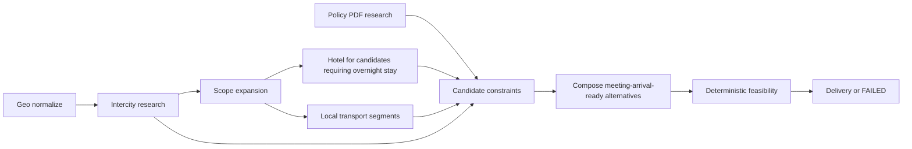

# M4.3：差旅最小纵向切片

> 文档状态：Frozen v1.0，可在 M4.2 验收后编写阶段 Plan  
> 前置阶段：M4.2 差旅语义与能力路由已验收  
> 后续阶段：M5 质量门、Critic 与局部修复  
> 本阶段性质：真实工具接入与 meeting-arrival-ready 最小纵向业务闭环

## 1. 阶段定位

M4.3 在 M4.1 已建立评测标尺、M4.2 已稳定决定“需要查什么”的基础上，接入真实政策、去程、酒店和市内交通能力，形成第一条可追溯、可失败、可复现的商务差旅纵向切片。

```text
差旅请求
→ 会议与约束解释
→ 范围和能力路由
→ 本地政策 PDF / 去程 / 酒店 / 市内交通
→ Evidence Registry / Candidate Pool
→ meeting-arrival-ready 多方案骨架
→ 确定性可行性检查
→ 明确披露返程未规划
```

本阶段的首要成功条件不是输出文字丰富，而是能够基于 Evidence 证明：在当前候选、时间、缓冲和政策条件下，用户存在可行的准时参会安排；若不能证明，系统必须失败或澄清。

## 2. 产品边界

首版支持：

- 单人旅客；
- 中国大陆境内跨城差旅；
- 单个出发城市；
- 单个目的城市；
- 一个明确的首场会议到达目标；
- 一个直达航班或直达铁路去程候选，不组合城际中转；
- 2～3 份差异化去程方案，如前一日到达并住宿、会议当日凌晨到达并直达会场；
- 每个去程候选至多一晚、按需生成的会前住宿；
- 机场/车站—酒店/会场、酒店—会场的必要市内交通；
- 本地 PDF 中的公司政策规则与页码级引用；
- 结构化方案骨架、预算、假设、警告和 Evidence 引用。

默认不支持：

- 返程；
- 国际及港澳台差旅；
- 多旅客；
- 多城市、多段开放式行程；
- 联程航班、城际中转和跨供应商换乘；
- 景点、活动、门票、餐饮推荐；
- 真实预订、付款、取消、改签；
- 会议期间住宿、会后住宿和完整多日会务安排；
- 完整向量 RAG；
- 完整 G0～G5、独立 Critic 和 Repair。

## 3. 阶段目标

- 实现 `PolicyKnowledgePort + 本地 PDF Adapter`；
- 接入并标准化真实去程航班/城际交通候选；
- 仅为需要过夜的去程候选检索一晚会前酒店；
- 检索必要市内交通路线并标准化为本地交通候选；
- 让所有动态事实进入 Evidence Registry，携带来源、时间、TTL 和原始引用；
- 让 Composer 只消费 Candidate/Evidence ID，不凭空补全；
- 用确定性服务检查首场会议到达时限、候选级会前酒店、路线衔接、预算与政策单位；
- 建立 Offline E2E、真实工具 Contract/Smoke 和受预算控制的 Live E2E；
- 使用 M4.1 数据集生成 M4.3-current 和最终差异报告。

## 4. 技术选型

### 4.1 公司政策

首版选择：

```text
PolicyKnowledgePort
→ LocalPdfPolicyAdapter
→ 页码感知文本块
→ 结构化 PolicyRule / PolicyEvidence
```

约束：

- 使用文本型 PDF，不在首版加入 OCR；
- PDF 解析库固定为 `pypdf==6.14.2`；只读取项目自有文本型 PDF，不启用 OCR、图像提取或加密 PDF；
- 保存文档 hash、版本、有效期、页码和字符区间；
- 规则提取结果通过 Pydantic Schema；
- 允许少量人工结构化 Oracle 校验关键条款；
- 不把整份 PDF 直接塞入 Prompt；
- 不使用向量数据库，不把简单关键词命中伪称为完整 RAG。

演示政策固定为项目自有的 `universal-business-travel-policy-v1.pdf`：它是为本项目编写的合成公司政策，可随项目公开展示，不包含真实公司或员工信息。源 Markdown、生成 PDF、文档 hash、版本和数据卡必须一并入库。关键 Oracle 只包含国内去程单人总价上限、单晚酒店总价上限、会议最小提前到达时间和本地交通许可四类规则；不包含员工等级、舱等、审批流或个性化例外。

如果 PDF 无法稳定提取上述关键条款，应阻断 M4.3，而不是改用无引用的手工常量并标记成功。

### 4.2 动态供应商

- 航班/城际交通、酒店：通过现有 Tuniu MCP/Adapter 边界接入；
- 地理编码和市内交通：通过现有 Amap Adapter 边界接入；
- 领域层只依赖 Port 和标准化 DTO，不依赖供应商 SDK/字段；
- 所有供应商调用使用显式 timeout、调用预算和 `retry_count=0`；
- 单元和普通集成测试使用显式 Fake/HTTP Fixture；
- Live 测试失败时禁止 cache、fallback、估算或合成候选。

首版只依赖当前供应商能够稳定标准化的最小字段，不把供应商未承诺的字段写成阻断合同：

- Tuniu 航班/铁路：班次标识、出发/到达地点、出发/到达时间、含税总价；
- Tuniu 酒店：酒店标识、名称、城市、查询入住/退房日期和供应商最低报价；因首版恰好一晚，保存 `quoted_amount`、`price_basis=provider_lowest_quote`、`night_count=1` 和 `total_amount`，不得把未知税费、库存或取消规则伪造为已知；
- Amap：新增独立 LocalRoute Port/Adapter，使用路线规划 2.0 的驾车/出租车场景，只规范化起终点、总时长秒、总距离米、出租车费用和路线状态；不加入公交换乘、多模式比较或实时导航。

任一阻断字段缺失时按响应 Schema/证据失败处理；可选字段缺失必须显式为 `unknown`，不得从模型记忆补齐。

### 4.3 规划与验证

- LLM 用于约束解释、候选摘要和方案表达；
- 日期、时区、缓冲、候选级会前住宿、价格合计、路线时长和硬约束使用确定性代码；
- M4 现有混合规划器可扩展为差旅方案骨架，但不得绕过 Candidate Pool；
- 完整 GateRunner 与独立 Critic 留到 M5。

## 5. PolicyKnowledgePort 合同

输入至少包含：

```text
policy_document_ref
trip_context
query_topics
as_of
call_budget
```

输出至少包含：

```text
policy_document_id
document_hash
document_version
effective_from
effective_to
rules
citations
observed_at
status
```

每条 `PolicyRule` 至少包含：

```text
rule_id
topic
operator
value
unit
currency
applicability
page_number
source_span
confidence
```

政策缺失、过期、冲突、页码丢失或解析失败必须产生结构化错误，不得当作“无政策限制”。

## 6. Evidence 与 Candidate 合同

### 6.1 Evidence

动态 Evidence 至少携带：

```text
evidence_id
source_type
source_ref
observed_at
valid_until
status
confidence
raw_ref
```

计划生成时必须使用同一 `EvidenceSnapshot`。价格、库存、路线时长等事实过期后不得继续进入正常 Delivery。

### 6.2 去程候选

至少包含：

```text
candidate_id
transport_subtype
origin
destination
departure_at
arrival_at
timezone
arrival_station
total_amount
currency
price_basis
evidence_ids
```

`transport_subtype` 固定为 `intercity`。兼容迁移方式为：现有 `TransportCandidate.kind="transport"` 保持不变，新增受控 `segment_kind: Literal["intercity", "local"]`，历史构造默认值为 `intercity`；M4.3 新代码不得再依赖 `mode` 自由文本判断城际或市内段。

### 6.3 酒店候选

至少包含：

```text
candidate_id
hotel_id
name
address
check_in_date
check_out_date
quoted_amount
total_amount
currency
night_count = 1
price_basis = provider_lowest_quote
evidence_ids
```

首版只允许一晚，因此 `quoted_amount` 可作为一晚总价，但字段必须保留供应商语义和来源；政策统一比较 `total_amount`。税费、库存和取消条款只有供应商明确返回并通过 Schema 后才可加入 Evidence，本阶段不以这些可选字段作为 Live 通过前提。

### 6.4 市内交通候选

至少包含：

```text
candidate_id
from_location
to_location
depart_at
arrival_at
duration_minutes
distance
mode
estimated_amount
currency
route_status
evidence_ids
```

首版 `mode` 固定为 `driving_taxi`。Amap 请求必须包含 `show_fields=cost`；`duration`、`distance` 或出租车费用缺失均视为本阶段阻断 Schema 失败，不用直线距离或模型估价替代。

## 7. 检索与任务依赖

任务图至少表达：



独立政策与地理/去程研究可以并行；住宿和市内交通必须等待去程到达事实与范围扩展。缺少依赖产出时，下游任务不得启动。

## 8. 会前住宿规则

- 住宿任务按候选的 `PreMeetingLodgingRequirement` 创建，每个候选最多一条；
- 会议前一日到达并过夜的候选必须至少有一个满足硬约束的酒店；
- 会议当日到达且通过到达时限的候选不得强制添加酒店；
- 同一请求可以同时保留需要酒店和无需酒店的可行方案；
- 跨午夜按目的地时区计算；
- 某个候选的酒店无结果、不可用或证据过期时，只淘汰该候选；不得连带淘汰独立可行的无住宿候选；
- 首版不查询会议期间、会后或第二晚酒店；每晚价与一晚总价仍必须分字段。

## 9. 确定性可行性

M4.3 至少执行以下阻断检查：

- 去程到达时间 + 入境/出站配置 buffer + 市内路线时长 + 会议 buffer ≤ 会议开始时间；
- 需要住宿的候选具有一晚会前酒店覆盖；
- 酒店入住/退房日期与首场会议日期一致；
- 酒店—会场路线在需要时存在；
- 政策单位、币种和价格口径一致；
- 所有计划项引用存在且有效的 Candidate/Evidence；
- 返程状态明确为 `not_planned`；
- 禁止景点/活动进入主计划。

M4.3 的这些检查是最小纵向切片的确定性验证，不替代 M5 的统一 GateRunner。

到达缓冲使用 M4.2 冻结的确定性优先级：`effective_arrival_buffer = max(user_minimum, policy_minimum, system_default_30m)`；机场离站 45 分钟、铁路出站 20 分钟、市内交通风险 20 分钟沿用 `timing-policy-cn-domestic-v1`，不得在 Composer 中重算或改写。

## 10. Composer 与交付合同

Composer 必须：

- 只选择 Candidate Pool 中存在的候选；
- 每个计划项引用 candidate/evidence ID；
- 不改写政策数值、价格或时间；
- 不补写未检索到的酒店、路线或航班；
- 输出假设、警告、政策例外和范围披露；
- 为每份方案输出结构化推荐理由，理由只引用该方案的时间、价格、缓冲、政策和 Evidence；
- 在冻结成功案例中输出至少两份真实不同的方案；差异必须来自去程 candidate ID、是否包含会前住宿，或由 Evidence 支持的时间/价格取舍，不能只改“省钱/均衡/舒适”标签；
- 当阻断检查失败时不生成“看起来完整”的正常方案。

交付至少包含：

```text
planning_horizon = meeting_arrival_ready
planning_end = first_meeting.required_arrival_at
return_scope = not_planned
return_reason = excluded_by_mvp_scope
meeting
alternatives[]
  outbound_transport
  optional_pre_meeting_lodging
  local_transport_segments
  total_price
  arrival_margin_minutes
  policy_compliance
  recommendation_reasons
policy_findings
assumptions
warnings
evidence_refs
```

## 11. 失败语义

至少覆盖：

```text
POLICY_DOCUMENT_NOT_FOUND
POLICY_PARSE_ERROR
POLICY_EVIDENCE_EXPIRED
POLICY_CONFLICT
INTERCITY_PROVIDER_ERROR
NO_FEASIBLE_INTERCITY_CANDIDATE
HOTEL_PROVIDER_ERROR
MISSING_PRE_MEETING_LODGING
LOCAL_TRANSPORT_PROVIDER_ERROR
LOCAL_ROUTE_UNREACHABLE
EVIDENCE_EXPIRED
CANDIDATE_SCHEMA_ERROR
MEETING_ARRIVAL_INFEASIBLE
CALL_BUDGET_EXHAUSTED
```

所有错误必须转换为 `WorkflowError`，包含 trace、阶段、上游引用、可重试性和安全摘要。

## 12. 测试策略

M4.3 继续执行“组件门先于阶段集成门”。真实工具 Smoke 只能验证接口现实字段，不能替代组件离线故障注入，也不能替代完整纵向 E2E。

### 12.1 Component Eval

| 组件 | 主要失败模式 | 核心指标 |
|:---|:---|:---|
| Policy Retrieval | 漏召回、错引页码、无依据规则、无答案不拒答 | Recall@k、citation accuracy、rule faithfulness、no-answer accuracy |
| Intercity Adapter | 工具选错、填参错误、日期/时区/税费/库存误解析 | tool selection accuracy、argument accuracy、Schema valid rate、normalization accuracy |
| Stay Adapter | 入退日期错误、候选关联错误、nightly/total 混淆、取消条款丢失 | candidate lodging query coverage、price semantic accuracy、Schema valid rate |
| Local Transport Adapter | 地点填参错误、路线不可达误判、时长字段错误 | argument accuracy、route status accuracy、duration normalization accuracy |
| Evidence/Candidate | TTL、来源、去重、引用或 subtype 错误 | evidence validity rate、candidate normalization accuracy、traceability |
| Planner/Composer | 幻觉候选、证据断链、硬约束遗漏、方案理由无依据、返程/景点范围错误 | illegal reference rate、evidence coverage、feasibility accuracy、recommendation grounding、disclosure rate |

政策检索指标必须区分 retrieval 与 rule extraction：答案文本看似正确但 Recall@k、页码引用或规则忠实度失败时，组件仍失败。

### 12.2 Offline Component Suite

- PDF 文本、页码、hash、版本和有效期；
- 政策规则提取成功、空结果、冲突、非法 Schema；
- 航班/酒店/Amap Adapter 契约 Fixture；
- 每晚价、税费、总价、币种；
- 跨午夜、时区、buffer、前一日住宿与当日直达；
- 不可达路线、无酒店、无去程、证据过期；
- 调用预算耗尽和超时；
- Candidate/Evidence allowlist；
- Composer 禁止幻觉候选；
- 完整 Offline E2E 的成功与每个阻断失败分支；
- 无 cache/fallback/partial success。

### 12.3 Live Tool Contract/Smoke

分别验证：

- 本地 PDF 对选定关键条款的页码级引用；
- 真实航班/城际接口的日期、时区、价格、税费、库存字段；
- 真实酒店接口的入住/退房、每晚价、总价和取消条款；
- 真实 Amap 路线的地点、时间、距离和状态字段。

Live Smoke 不是 E2E 成功的替代品。

### 12.4 Stage Integration Eval

Offline Stage Integration 使用固定 LLM、固定 Clock 和 Fake/HTTP Fixture 跑完整纵向链路，必须检查：

- 关键任务轨迹和依赖合法；
- Evidence/Candidate/Plan ID 引用连续；
- 每个方案所需的会前住宿和本地移动段被覆盖；
- 缺任一关键能力时进入 FAILED，不产生静默部分成功；
- Composer 不访问未登记事实；
- meeting-arrival feasibility 由确定性服务证明；
- 至少两份差异化方案的推荐理由只引用时间、价格、政策和 Evidence 中可验证的事实。

报告必须单独给出 `pass@1`、固定 k 下的 `pass-all-k`、trajectory validity、silent partial success rate、第一失败阶段、调用数、延迟和成本。

### 12.5 Live E2E

至少一个固定、脱敏、受预算控制的案例跑通：

```text
真实 LLM
+ 本地政策 PDF
+ 真实去程供应商
+ 真实酒店供应商
+ 真实市内交通供应商
→ meeting-arrival-ready Delivery
```

如果外部供应商无法返回满足条件的真实候选，应记录为外部依赖/无候选失败并阻断验收，禁止注入 Fake 补齐同一次 Live 运行。

Live Gate 固定为一条脱敏国内单人案例，会议日期由 Runner 选择运行日后 14～21 天内的工作日并把渲染后输入及 hash 写入 Artifact。它是“真实依赖可运行”门，不与不同日期的历史运行做业务分数归因。单次验收最多允许：LLM 3 次、Tuniu 4 次、Amap 8 次、PDF 读取 1 次，总外部调用不超过 16 次，`retry_count=0`；若存在版本化价格表，LLM 估算成本上限为 5 CNY，否则 Token 与调用数上限作为阻断预算。输入不得包含真实公司、员工、联系方式或证件。

## 13. 评测与指标

使用 M4.1 冻结数据集生成：

```text
M4.3-current
M4.3-vs-M4-before
M4.3-vs-M4.2
```

BLOCKING 指标：

- M4.2 语义、范围、能力和依赖指标继续保持 100%；
- `candidate_pre_meeting_lodging_exact_match = 100%`；
- 关键 `evidence_coverage = 100%`；
- 关键 `candidate_coverage = 100%`；
- `meeting_arrival_feasibility_accuracy = 100%`；
- `recommendation_grounding_rate = 100%`；
- `return_scope_disclosure_rate = 100%`；
- `forbidden_output_rate = 0%`；
- 价格口径、币种和政策比较准确率 = 100%；
- Schema 与失败语义准确率 = 100%；
- 无未分类异常、无 fallback、无合成成功。
- BLOCKING 离线重复运行集 `pass-all-k = 100%`；
- 关键轨迹合法率 = 100%。

同时报告 p50/p95 延迟、LLM/工具调用数、Token、估算成本和按供应商的失败分布。性能与成本暂不设拍脑袋阈值，但必须与 M4-before/M4.2 分层解释。

## 14. 验收标准

- [ ] M4.1、M4.2 已验收，冻结数据集和合同未被改写；
- [ ] PolicyKnowledgePort 与 PDF Adapter 通过契约和真实文档测试；
- [ ] 航班/城际、酒店、市内交通 Adapter 均通过 Fixture 与 Live Contract；
- [ ] Policy、各 Tool Adapter、Evidence/Candidate 与 Planner/Composer 的 Component Scorecard 分别通过；
- [ ] 只有需要过夜的候选查询一晚会前酒店，并保留候选、酒店与 Evidence 关联；
- [ ] 冻结成功案例至少输出两份可行且有真实差异的方案；Live 无足够候选时显式失败或说明无可行候选，禁止复制同一方案凑数；
- [ ] 去程到会议的完整时空链可确定性验证；
- [ ] Composer 不生成 Candidate Pool 之外的事实；
- [ ] Offline E2E 成功路径和规定失败路径全部通过；
- [ ] Component 与 Stage Integration 分数卡独立，不以总分抵消 BLOCKING 失败；
- [ ] Live E2E 使用全真实依赖完成且报告可追踪；
- [ ] M4.3-current 与两个 diff 报告完整，BLOCKING 指标达标；
- [ ] 返程未规划和景点排除均明确；
- [ ] M0～M4.2 回归通过；
- [ ] 未提前实现 M5 Gate/Critic/Repair 或 Action。

阶段通过公式：

```text
M4.3 Pass
  = Offline E2E Pass
  + Live Tool Contracts Pass
  + Live E2E Pass
  + Frozen Eval Thresholds Pass
  + No Regression
```

## 15. 交付物

- PolicyKnowledgePort、本地 PDF Adapter 与政策 Fixture；
- 去程、酒店、市内交通标准化 Adapter 与合同测试；
- 差旅 Research 任务及两阶段 Task Graph 集成；
- Evidence/Candidate 差旅字段和迁移说明；
- meeting-arrival-ready Composer/Plan 多方案输出；
- 最小确定性可行性服务；
- Offline E2E、Live Contract、Live E2E；
- M4.3-current、diff 和阶段验收报告。

具体实现文件、Spike 顺序和提交批次由 M4.3 Plan 决定。

## 16. 冻结的 Plan 输入

M4.3 Plan 必须直接采用本 Spec 已冻结的项目自有合成 PDF、`pypdf==6.14.2`、Tuniu 最小规范化字段、Amap 驾车/出租车路线合同、`segment_kind` 兼容迁移、版本化 buffer 优先级和 16 次 Live 调用预算。实现期间如果真实供应商证明某个阻断字段不存在，只能返回 Spec 评审并缩减或替换该合同，不能在代码中静默估算、Fake 补齐或放宽验收。

## 17. 进入 M5 的条件

- meeting-arrival-ready 纵向切片已通过 Offline 与 Live 双轨验收；
- M4.1 数据集已能对全链路评分；
- 计划项、候选、证据、政策和会议具有稳定 ID；
- 确定性失败能够形成结构化问题输入；
- 无 legacy 自由文本规则承担主链路决策；
- M5 可以在不重做工具接入的前提下增加统一 Gate、Critic 和 Repair。

## 18. 版本记录

| 版本 | 日期 | 变更 |
|:---|:---|:---|
| Draft v0.1 | 2026-08-12 | 从原 M4.1 拆出政策、去程、必要住宿夜、市内交通与 attendance-ready 最小纵向闭环。 |
| Draft v0.2 | 2026-08-12 | 增加 Policy、Tool、Evidence/Candidate、Planner/Composer 组件矩阵，以及 Offline/Live 阶段集成和轨迹稳定性门。 |
| Draft v0.3 | 2026-08-12 | 同步 `meeting_arrival_ready`：输出 2～3 份到首场会议的差异化方案；酒店改为候选级最多一晚，并增加基于时间、价格、政策与 Evidence 的推荐理由。 |
| Frozen v1.0 | 2026-08-12 | 按快速求职目标冻结项目自有合成政策 PDF、pypdf、Tuniu 最小字段、Amap 驾车/出租车路线、Candidate 兼容迁移、buffer 优先级与受预算控制的单案例 Live Gate。 |
