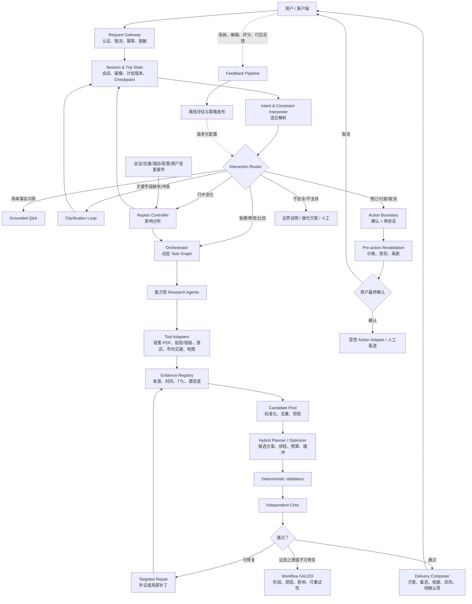
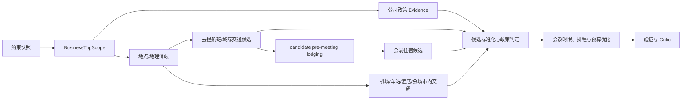
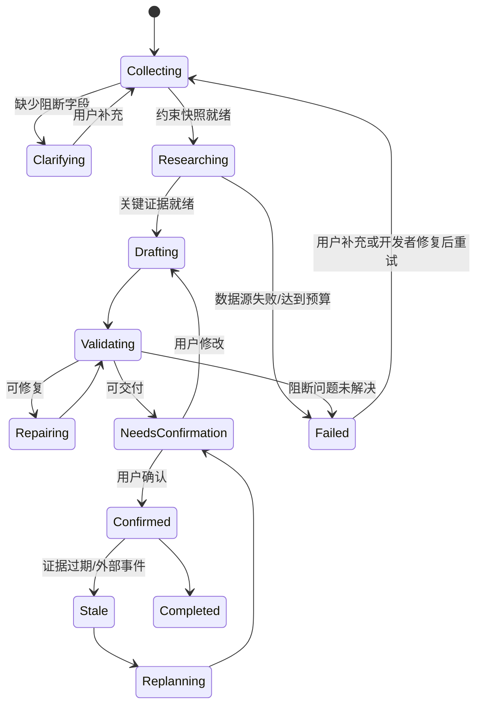

# 企业商务差旅规划 Agent 项目架构与业务边界说明

> 文档状态：Core Architecture v2.2（历史决策整理），M0～M6 求职完成线已记录；M4.1 已验收，当前进入 M4.2 讨论
> 文档类型：项目级架构、业务边界与历史决策说明
> 使用方式：按当前任务选择性查阅；代码、测试和实际运行结果是开发判断的主要依据
> 当前实现基线：M0、M1、M2、M2.1、M3、M4 通用内核及 M4.1 评测基线已完成验收  
> 当前待实施阶段：M4.2 差旅语义与能力路由
> 后续已定义顺序：M4.2 差旅语义与能力路由 → M4.3 差旅最小纵向切片 → M5  
> 最后更新：2026-08-16

---

## 摘要

企业商务差旅规划并非一般性的旅游内容生成，而是在会议时限、公司政策、动态交通与住宿事实共同约束下完成的交互式约束满足问题。系统既要理解自然语言中的会议要求与个人偏好，又要依赖外部工具获得航班、铁路、酒店和市内交通等动态事实，并以确定性代码验证时间、预算、候选级会前住宿覆盖和政策合规性。任何关键事实的缺失、过期、冲突或解析失败，都可能使方案失去可执行性。

本项目研究并实现一种面向企业单人差旅场景的 Agent 架构。其核心方法是：先将用户请求解释为类型化约束，再由确定性的 `BusinessTripScopeResolver` 决定本次规划必须覆盖的业务组件；随后由 Router 和 Orchestrator 生成动态任务图，调用政策、城际交通、住宿和市内交通能力；研究结果统一进入 Evidence Registry 与 CandidatePool；混合规划器生成有限个候选方案；G0～G5、Independent Critic 与 Targeted Repair 共同完成验证和有界修复。

为尽快形成可面试、可运行、可解释的求职作品，M4.1～M6 的 MVP 固定为中国大陆境内、单人、单出发城市、单目的城市和一场首要会议；国际/港澳台、明确多人和多城市请求返回 `UNSUPPORTED_SCOPE`。

求职版产品边界定义为 `meeting_arrival_ready`：规划从用户出发地开始，终止于首场会议的 `required_arrival_at`。系统比较能够按时到场的去程方案，其中可以包含前一日到达并住宿，或会议当日凌晨到达并直达会场；会议结束时间、会议期间住宿、会后住宿和返程默认不规划。返程必须在交付结果中明确标记为 `not_planned`，景点、门票、娱乐活动和旅游 POI 不进入商务差旅主链路。公司政策首版为一份对所有用户一致适用的通用 PDF，通过稳定的 `PolicyKnowledgePort` 调用受控本地 PDF Adapter；不实现登录身份、员工等级或个性化政策匹配。只有离线检索评测证明结构化或关键词检索不足时，才引入 Embedding、BM25、向量数据库或混合检索。

项目采用任务驱动、测试驱动、评测驱动和失败优先的开发方法。本文记录业务目标、技术选择、模块边界和阶段背景，但不作为每次任务的强制执行协议。开发时根据用户目标选择相关背景，最终结论由代码、测试、真实工具实验和运行报告共同支持。

**关键词：** Business Travel Agent；Constraint Satisfaction；Tool Use；Evidence Grounding；Dynamic Task Graph；Policy Retrieval；Hybrid Planning；Evaluation；Targeted Repair

---

## 前言：本文如何被使用

本文同时承担四项参考职责：

1. **业务设计文档**：说明系统解决什么问题、服务谁、做到哪里停止；
2. **技术选型说明**：说明模型、确定性服务、工具、数据和基础设施如何分工，以及为什么选择当前方案；
3. **演进蓝图**：记录 M0～M9 的依赖关系、阶段目标和完成线；
4. **项目学习记录**：保留关键决策的推导过程、替代方案和重新评估条件。

本文不是程序可以直接执行的参数表，也不是要求 Agent 一次性生成全部代码的说明书。正确使用方式是：

```text
业务问题与技术假设
→ 按需查阅架构、路线图和决策记录
→ 相关代码与测试
→ 失败测试与最小实现
→ Offline Eval / Live Gate
→ Review、阶段报告与交接
→ 根据证据修订代码、测试或相关说明
```

项目维护者负责提出目标、审核业务规则和接受最终取舍；AI 负责扩展问题清单、比较候选方案、协助形成文档与实现；测试和真实实验决定假设是否成立。不得把 AI 的文字分析直接当成业务事实或验收证据。

> **设计推导与学习提示**  
> 参考 `finetune-spec.md` 的核心方法不是复制其章节名称，而是复用其决策逻辑：先定义任务和唯一合同，再比较技术候选，明确选择依据与不选择原因，最后用统一评测和阶段实验决定方案是否成立。本文因此将“当前事实”“目标设计”“技术假设”和“未来扩展”严格分开。

---

## 0. 项目背景、研究问题与范围

### 0.1 业务背景

企业员工或行政人员安排一次跨城会议时，需要同时处理会议地点与到达时限、公司允许的交通方式和等级、动态票价与库存、候选方案是否需要会前住宿、酒店价格与区域规则、市内通勤、预算与取消条款。这些信息分散在用户自然语言、公司政策文档和供应商工具中。

自由文本模型可以生成流畅建议，却无法凭记忆知道真实班次、库存、价格、酒店状态或公司政策；纯规则系统可以准确计算时间与金额，却难以理解模糊需求和解释方案取舍。因此，本项目选择“LLM 负责语义理解与受控生成，工具负责动态取数，确定性服务负责计算与否决”的混合架构。

### 0.2 从旅游规划转向商务差旅

项目 M0～M4 最初以通用旅行规划为业务外壳，已完成约束、路由、Evidence、Candidate、Task Graph、Research Agent 和混合规划等通用内核。然而，M4 验收暴露出关键语义缺口：用户请求完整行程时，Interpreter 只抽取出发地、目的地、日期和人数；Router 又将 `PLAN` 默认映射为 `geo + transport`；CandidatePool 因而只有交通候选，Composer 最终只能生成一项交通方案。

该问题证明，通用 Agent 基础设施成立不等于业务合同成立。项目因此不继续扩展景点、门票和娱乐活动，而是收敛到企业商务差旅：其目标更明确、硬约束更可测、动态证据更重要，也更适合展示 Tool Use、RAG、确定性验证、Agent 编排与 Eval 的组合能力。

### 0.3 研究问题

本项目围绕以下问题展开：

1. 如何把模糊差旅请求转换为稳定、可验证的会议和政策约束？
2. 如何避免 Router 仅依赖 LLM 显式 category，从而漏掉政策、酒店或市内交通能力？
3. 如何将静态公司政策和动态供应商事实统一治理，同时保持不同的版本和生命周期？
4. 如何证明一个方案在当前证据下可以按时参会，而不是只生成看似合理的文本？
5. 如何在工具失败、证据缺失或修复不收敛时显式失败，而不是伪造部分成功？
6. 如何用小而高价值的评测集发现系统性缺口，而不是先制造海量数据？
7. 如何把过程组织为可审查、可复现、适合求职展示的工程证据链？

### 0.4 一句话项目定义

构建一个企业商务差旅规划 Agent：系统读取用户的出差请求和首场会议到达时限，检索通用公司政策、去程航班或其他城际交通、方案所需的会前一晚住宿和市内交通证据，生成在当前 Evidence 和缓冲规则下能够按时到会且符合政策的多份可解释方案，并明确展示费用、推荐理由、风险、证据和未规划范围。

### 0.5 Meeting-arrival-ready 产品边界

求职版规划边界为：

```text
planning_horizon = meeting_arrival_ready
planning_end = first_meeting.required_arrival_at
return_scope = not_planned
return_reason = excluded_by_mvp_scope
```

系统从出发地开始，终止于首场会议 `required_arrival_at`。每个方案必须覆盖通用公司政策、去程交通、到达节点至酒店或会场的必要市内交通；若该方案前一日到达，还必须覆盖一晚会前酒店及酒店至会场通勤。系统允许同时比较“前一日到达 + 酒店”和“当日凌晨到达 + 直达会场”等方案，并展示价格、耗时、缓冲、政策合规和推荐理由。

会议结束时间、会议期间住宿、会后住宿和返程均不是 meeting-arrival-ready 的 G1 blocker。用户明确要求这些能力而当前阶段尚未支持时，应返回 `UNSUPPORTED_SCOPE` 或范围说明，不得把未实现能力包装成正常方案。系统不承诺现实世界“绝对准时”，只证明当前 Evidence 和缓冲规则下可在 `required_arrival_at` 前到达。

### 0.6 非目标

M4.1～M6 不实现：

- 景点、门票、娱乐活动、旅游 POI 和旅游内容推荐；
- 多城市复杂行程、多人团体优化和持续行中导航；
- 国际及港澳台差旅；此类请求不补充签证、入境或海外地图能力；
- 真实订票、订房、付款、取消和改签；
- 自动审批或伪造政策例外已获批准；
- 用户长期画像和在线自学习；
- 完整向量 RAG、缓存回退、备用供应商和无标识部分成功；
- 对现实世界“绝对准时”的承诺。

### 0.7 当前实现状态

截至本文版本，M0、M1、M2、M2.1、M3 和 M4 已完成历史验收，M4.1 评测基线已完成正式验收。已实现 Pydantic 领域模型、状态与错误、Interpreter/Router、请求级可观测性、Tool Port 与 Amap/Tuniu Adapter、Evidence Registry、CandidatePool、Task Graph、Research Agent、Schedule/Budget 和结构化 Composer，以及 M4.1 的评测基础设施。

历史验收只证明通用内核在原规格下成立，不证明商务差旅纵向链路已经成立。当前状态必须描述为：

```text
Implemented: M0～M4 通用内核；M4.1 评测基线
Specified: M4.2～M9 差旅业务目标
Proposed: ACC-INFRA-1 阶段人工验收接口；EVAL-OBS-1 评测基线可视化与观测面
Not implemented: BusinessTripScopeResolver、PolicyKnowledgePort/PDF Adapter、完整市内交通切片、G0～G5 统一闭环、API Demo、SQLite Replan、Action、生产韧性，以及 ACC-INFRA-1、EVAL-OBS-1 提案对应的新增观测实现
```

### 0.8 预期贡献

- `Interpreter → ScopeResolver → Router` 三层语义合同；
- 面向政策、去程、候选级会前住宿和市内交通的动态 Task Graph；
- 区分静态政策与动态供应事实生命周期的 Evidence Registry；
- “硬约束先否决、质量向量后排序”的混合规划方法；
- G0～G5、Independent Critic 和版本化 Targeted Repair；
- Offline Suite 与 Live Gate 分轨的 Agent 评测体系；
- 架构说明、阶段背景、测试与实验报告共同帮助解释开发结果。

## 1. 架构结论

商务差旅规划不是一次性的二分类判定，而是一个**交互式约束满足 + 多目标优化 + 动态重规划**问题。

参考架构中的控制思想可以复用，业务语义必须重构：

| 参考架构能力 | 商务差旅规划中的适配 |
|:---|:---|
| Gateway、认证、幂等 | 保留；增加隐私脱敏、会话恢复和计划版本 |
| 白名单/黑名单/灰区路由 | 改为直接问答、澄清、新建规划、修改、比较、行中重规划、高影响动作 |
| 风险子 Agent | 改为按规划能力拆分的 Research Agent，按任务动态选择 |
| Orchestrator 有界 ReAct | 保留；执行显式 Task Graph，循环依据是证据缺口与校验问题 |
| 确定性评分融合 | 改为“硬约束先否决 + 多维质量向量排序” |
| 独立 Critic | 保留；基于约束快照和可追溯证据复核 |
| 放行/OTP/拒绝/转人工 | 改为回答、澄清、草案、用户确认、显式失败、人工接管 |
| 异步事后学习 | 保留；动态价格/库存不进入长期知识，策略变更先离线评估 |

目标方案为：

**混合路由 + 版本化旅行状态 + 动态任务图 + 能力型 Research Agent + 证据注册表 + 候选池 + 混合规划器 + 确定性验证器 + 独立 Critic + 有界局部修复 + 人在回路 + 事件驱动重规划。**

---

## 2. 为什么不能直接照搬欺诈检测架构

| 欺诈检测 | 商务差旅规划 |
|:---|:---|
| 输入通常是结构化交易事件 | 输入通常是多轮、模糊、自然语言需求 |
| 目标是风险判断 | 目标是从多个可行方案中优化体验与成本 |
| “拒绝”是正常终态 | 更常见的是追问、解释取舍、给备选或请求放宽约束 |
| 证据用于判断一次交易 | 证据还要支撑多日排程、预算和后续局部修改 |
| 结果短时间内稳定 | 价格、库存、班次、市内路线和政策版本可能变化 |
| 单一风险分可聚合 | 总分不能抵消日期冲突、超预算等硬伤 |

因此，参考图的 Router 应变成**交互模式路由器**，风险证据层应变成**带时效的旅行证据层**，评分融合层应变成**硬约束 Gate 与多目标优化器**。

---

## 3. 设计原则

1. **约束先于生成**：先形成类型化 `ConstraintSnapshot`，再检索和规划。
2. **事实先于文案**：政策、价格、班次、市内路线和地理位置必须来自 Tool/Policy Port；开发期禁止用估算值替代查询失败。
3. **硬约束不可被总分抵消**：阻断问题必须单独处理。
4. **动态数据必须带时效**：记录来源、查询时间、有效期和置信度。
5. **Agent 负责判断，工具负责取数**：不是每个 API 都包装成 Agent。
6. **按依赖串并行混合执行**：独立检索可并行，规划和验证按依赖有序执行。
7. **局部修复优先**：只重查、重排受影响部分，不默认整份重生成。
8. **计划与交易分离**：搜索默认只读；预订、付款、取消必须显式确认并再次验证。
9. **有界自治**：任务数、调用数、修订轮次、总时长和成本都有上限。
10. **开发期 Fail-fast**：缺失、冲突、过期、解析失败和工具失败必须使对应 Gate 或工作流失败，禁止自动补全、部分成功或强制通过。
11. **反馈不直接改生产策略**：先进入离线评估，再版本化发布。
12. **先模块化单体，后按负载拆分**：先稳定接口边界，不为 Agent 数量过早引入微服务。
13. **阶段人工收口**：每个阶段进入下一阶段前必须提供独立于生产 CLI 的只读人工验收入口，展示关键边界输出并支持语义核对与人工记录；具体适配遵循 `ACC-INFRA-1`。

---

## 4. 总体架构



架构分为三个平面：

- **控制平面**：Gateway、Router、Orchestrator、状态机、调用预算、质量门；
- **数据平面**：工具适配器、Evidence Registry、Candidate Pool、知识库；缓存属于后期性能优化，开发期主链路不依赖缓存；
- **智能平面**：约束解释、Research Agent、方案生成、Critic、交付文案。

控制平面决定“是否继续、下一步做什么”。智能平面不能绕过控制平面执行高影响动作。

---

## 5. 同步交互链路

### 5.1 Gateway 与会话

Request Gateway 只做确定性入口能力：

- 身份认证、租户隔离、限流、请求大小限制；
- `request_id` 幂等和重复提交检测；
- PII 脱敏与日志字段白名单；
- Prompt Injection 基础检测；
- 日期、语言、币种、时区的语法级归一化；
- 加载或创建 `trip_id`，绑定当前 `plan_version`。

地名消歧、意图理解和约束优先级不是 Gateway 的职责。

会话状态区分：

- `conversation_state`：对话上下文；
- `trip_request`：当前旅行需求；
- `constraint_snapshot`：本轮规划使用的不可变约束快照；
- `evidence_snapshot`：方案引用的证据版本；
- `plan_version`：草案、修订稿和已确认稿；
- `pending_action`：尚未获得最终确认的外部写操作。

### 5.2 混合意图与约束解析

路由不能完全依赖正则，也不能完全交给 LLM：

1. 代码执行 Schema、权限、安全和显式命令检查；
2. 轻量模型把自然语言解析为类型化 `TripRequest`；
3. 代码校验日期、人数、金额、枚举及字段关系；
4. 低置信字段或冲突字段进入最少必要追问；
5. 用户确认或接受显式假设后，冻结 `ConstraintSnapshot`。

约束分为：

| 类型 | 示例 | 处理 |
|:---|:---|:---|
| `hard` | 日期、总预算上限、必须无障碍、绝不红眼航班 | 不满足则淘汰候选或说明不可行 |
| `soft` | 少换乘、酒店靠近会场、可灵活取消 | 用于排序并展示取舍 |
| `assumption` | 未给到达缓冲时使用已批准的企业默认值 | 显式展示，可被覆盖 |
| `unknown` | 会议结束时间、会后安排、特殊出行需求 | 结束时间不阻断首场到达规划；其他未知项仅在影响到达或政策时追问 |

`Negation Guard` 仅作为确定性召回补充，不能独立决定硬约束。例如“不是非要住五星级”不能机械解析为“禁止五星级”。

建议约束结构：

```text
Constraint {
  id,
  category,
  normalized_value,
  hardness,
  priority,
  scope,
  source,             # user / profile / system / assumption
  confidence,
  user_confirmed,
  conflict_group
}
```

### 5.3 Interaction Router

Router 输出工作模式，而非风险等级：

| 模式 | 典型请求 | 路径 |
|:---|:---|:---|
| `ANSWER` | “公司国内航班允许坐商务舱吗？” | 检索政策证据并直接回答 |
| `CLARIFY` | “明天去杭州开会”但无会议地点或开始时间 | 追问真正阻断参会可行性的字段 |
| `PLAN` | 新建跨城参会差旅 | 生成 meeting-arrival-ready 任务图 |
| `REFINE` | “酒店改到会场步行十分钟内” | 基于当前计划局部修改 |
| `COMPARE` | “飞机和高铁哪个更适合按时参会？” | 在同一约束和指标下生成可比候选 |
| `REPLAN` | 会议变化、航班取消、酒店失效 | 影响分析后局部或结构性重规划 |
| `ACTION` | 预订、付款、取消 | 高影响动作边界 |
| `UNSUPPORTED` | 缺少能力或不安全请求 | 说明边界并给替代方案 |

路由结果至少包含：

`mode`、`confidence`、`scope_version`、`required_capabilities`、`capability_reasons`、`missing_blockers`、`risk_flags`。其中 `required_capabilities` 必须来自 `BusinessTripScopeResolver`，Router 不得仅凭 Interpreter 的显式 category 推导能力。

### 5.4 Readiness Gate

不要求用户一次填满所有字段。仅当缺失项会显著改变可行性或成本时才阻断：

- 出发地无法确定；
- 会议城市、会议地点、开始时间或时区无法确定；
- 出行人数量或无障碍需求影响票务与到达可行性；
- 通用政策 PDF 未配置、版本冲突或不可读取；
- 预算表达互相矛盾；
- 硬约束发生冲突；
- 高影响建议缺少必要证件或授权前提。

会议结束时间、会议期间住宿和返程不是 meeting-arrival-ready 的阻断字段。非关键偏好可采用已批准、版本化且可追溯的默认值，并在交付中列出假设；通用公司政策、首场会议到达时限和动态库存不得用模型常识补全。一次只追问最关键的 1～3 个问题。

---

## 6. Orchestrator 与动态 Task Graph

Orchestrator 是受控主管 Agent，负责：

1. 读取不可变 `ConstraintSnapshot`；
2. 计算证据缺口；
3. 生成带依赖关系的任务图；
4. 并行调度互不依赖的研究任务；
5. 控制工具、Token、时长和重试预算；
6. 汇总结构化结果；
7. 根据验证问题补证或局部修复；
8. 写入状态转换、Checkpoint 和决策日志。



执行原则：

- 政策、地理和首轮去程研究可并行；对前一日到达的候选生成会前住宿需求，再按候选依赖查询酒店和市内交通；
- Agent 内部多步工具调用可以有界串行；
- 规划等待关键证据达到最低完整度；
- 同一供应商受并发、限流和熔断约束；
- 结果按稳定 ID 与 Schema 合并，不按完成顺序拼文本。

满足任一条件即停止自主循环：

- 关键证据就绪且不存在阻断问题；
- 达到补证轮次、工具/模型调用上限；
- 达到总时限或成本预算；
- 连续两轮没有减少阻断问题；
- 所有数据源均失败；
- 下一步需要用户选择或授权。

停止时若关键能力或 Evidence 缺失，返回结构化 CLARIFYING/FAILED、缺失项、影响和建议下一步；开发期禁止把可用部分包装成正常成功。

---

## 7. Agent 与工具边界

Agent 按“需要独立判断的能力”拆分，而不是按 API 数量拆分：

| 组件 | 职责 | 使用 LLM | 输出 |
|:---|:---|:---:|:---|
| `RequestInterpreter` | 意图、实体、约束、冲突、澄清问题 | 是 | `TripRequest`, `ConstraintSet` |
| `BusinessTripScopeResolver` | 将类型化事实确定性转换为 required/optional/excluded 能力范围 | 否 | `BusinessTripScope` |
| `PolicyResearchAgent` | 基于 PolicyKnowledgePort 检索公司政策并标准化规则 | 可选 | `PolicyRule[]`, `PolicyEvidence[]` |
| `IntercityTransportResearchAgent` | 去程航班/铁路、中转和到达节点 | 可选 | `TransportCandidate[]` |
| `StayResearchAgent` | required nights、酒店位置、每晚/总价和取消条款 | 可选 | `StayCandidate[]` |
| `LocalTransportResearchAgent` | 机场/车站、酒店和会议地点间路线与缓冲 | 可选 | `TransportCandidate[]` |
| `ItineraryComposer` | 基于已验证候选生成差异化行程骨架 | 是 | `PlanCandidate[]` |
| `CriticAgent` | 体验、遗漏、隐性冲突和解释复核 | 是 | `CriticReport` |

以下能力优先做成确定性服务：

- 路程矩阵、时区与日期运算；
- 预算加总、币种换算、税费计算；
- 会议到达截止时间、候选级会前住宿需求推导；
- 去程、换乘、入住/退房、市内通勤与缓冲区间相交；
- Schema 校验、去重、排序和 TTL；
- 权限、确认、审计和幂等。

每个 Agent 必须：

- 只通过 `AgentContext` 读取任务、约束快照和允许的工具；
- 返回类型化 `AgentResult`，不得直接修改全局状态；
- 每个实时事实引用 `evidence_id`；
- 将失败分类为 `retryable / needs_user / unsupported / fatal`；
- 不直接调用其他 Agent，由 Orchestrator 调度；
- 不把完整供应商响应放进模型上下文；
- 不在日志或结果中泄露凭证与不必要的 PII。

---

## 8. 工具适配、证据与候选池

### 8.1 Tool Adapter

地图、市内交通、航班/铁路、酒店、汇率和公司政策统一通过接口适配层访问。政策首版使用 `PolicyKnowledgePort + 本地 PDF Adapter`；完整 RAG 由离线评测决定是否引入。适配器负责：

- 请求/响应 Schema 转换；
- 超时、限流和供应商错误映射；
- 开发期不启用备用供应商、缓存回退、自动重试或合成数据；
- 原始数据引用和敏感字段清理；
- Mock 实现，保证测试不依赖真实 API。

工具返回一律视为**不可信外部输入**，经过类型、长度、HTML/指令注入和异常值清理后才能进入模型上下文。

### 8.2 Evidence Registry

研究结果先进入证据注册表，不能直接写入最终行程：

```text
EvidenceItem {
  evidence_id,
  entity_id,
  fact_type,
  value,
  source,
  source_ref,
  observed_at,
  valid_until,
  confidence,
  status,             # verified / estimated / conflicting / stale / unavailable
  raw_payload_ref
}
```

| 数据类型 | 示例 | 策略 |
|:---|:---|:---|
| 相对稳定知识 | 地理位置、城市时区 | 进入版本化知识库，定期复核 |
| 企业规则 | 舱等、席别、酒店上限、例外路径 | 按 policy version、页码/chunk、hash 和有效期保存 |
| 日期相关事实 | 班次、市内路线、会议地点 | 保存查询快照但不作为失败回退；携带日期和 TTL |
| 实时报价/库存 | 航班、铁路、酒店 | 只存快照，执行前再验证 |
| 推断/估算 | 未来路况、未返回税费、默认公司政策 | 开发期禁止自动生成或替代查询失败 |

来源冲突时保留多条证据并记录冲突，不允许最后写入者覆盖。

### 8.3 Candidate Pool

候选池负责：

- 实体解析与去重；
- 统一总价、币种和费用包含项；
- 统一地点时区；
- 硬约束剪枝；
- 新鲜度与完整度过滤；
- 保留入选和淘汰原因。

`AgentResult` 表示任务结果，`EvidenceItem` 表示可引用事实，`Candidate` 表示可参与规划的标准化选项，三者不得混用。

---

## 9. 混合规划与多目标优化

规划不能只依赖 LLM 自由生成，也不应把体验判断全部硬编码：

1. 代码根据硬约束剪枝；
2. `ItineraryComposer` 生成 2～3 个差异化骨架，如省钱、均衡、舒适；
3. 确定性排程器填入去程、方案级会前住宿、市内接驳、首场会议到达节点和机动时间；
4. 预算引擎计算总价区间、已知费用和缓冲；缺失费用直接产生验证问题；
5. 验证器淘汰不可行方案；
6. 对可行方案计算质量向量并做 Pareto/加权排序；
7. 展示主要取舍，而不是只给一个不可解释的最高分方案。

质量向量至少包括：

- `constraint_satisfaction`：硬/软约束满足度；
- `temporal_feasibility`：会议到达时限、去程、入住/退房、市内交通和缓冲；
- `budget_fit`：总价区间、风险敞口和余量；
- `traveler_fit`：差旅时段、通勤负担、偏好和特殊出行需求；
- `robustness`：航班/酒店取消弹性、备选与关键节点缓冲；
- `evidence_quality`：覆盖率、新鲜度、冲突与缺失比例。

硬约束 `FAIL` 时综合分无意义。只有通过硬约束的候选才能参加排序。

---

## 10. 质量门、Critic 与局部修复

### 10.1 分层质量门

| Gate | 时机 | 检查 | 失败路由 |
|:---|:---|:---|:---|
| G0 安全与输入 | 请求进入 | 权限、注入、PII、Schema、危险动作 | 拒绝危险部分、替代方案或人工 |
| G1 规划就绪 | 约束解析后 | 关键字段、歧义、约束冲突 | 澄清或记录假设 |
| G2 证据就绪 | 研究后 | 覆盖率、来源、TTL、冲突、关键缺失 | 补证仍失败则工作流 `FAILED` |
| G3 确定性可行 | 方案后 | 会议时限、时区、去程、市内交通、候选级会前住宿、政策、预算、硬约束 | 结构化局部修复 |
| G4 语义与体验 | G3 通过后 | 节奏、隐含需求、特殊人群、解释 | Critic 定向反馈 |
| G5 交付完整 | 输出前 | Schema、证据、假设、警告、备选、版本 | 返回结构化错误，禁止自动补全或强制交付 |
| G6 动作前验证 | 外部写操作前 | 最新价格、库存、条款、身份、确认 | 刷新并再次确认 |

### 10.2 Critic 的边界

`CriticAgent` 与生成者使用独立上下文和角色；可选使用不同模型，但“不同模型”不是事实正确性的保证。

Critic：

- 发现参会风险、通勤负担、偏好遗漏、解释不足和备选缺失；
- 引用 `constraint_id`、`plan_item_id` 或 `evidence_id`；
- 不在无证据时断言实时价格、库存、政策或交通状态；
- 输出结构化问题、严重级别、影响范围和修复建议；
- 不直接重写方案。

### 10.3 Targeted Repair

修复输入为 `ValidationIssue[]`，而不是自由文本长评语：

| 问题 | 修复 |
|:---|:---|
| 单条证据过期/缺失 | 只重查相关实体 |
| 会议到达或换乘缓冲不足 | 替换受影响去程/市内交通并重算下游 |
| 某候选所需的会前住宿缺失 | 仅为该候选补查一晚会前酒店，并重算其通勤、预算和政策 |
| 酒店失效或超政策 | 重选住宿并重算市内通勤、预算和政策 |
| 政策缺失或冲突 | 定向补证；仍失败则 CLARIFYING/FAILED |
| 预算轻微超支 | 替换边际效用最低的可选项 |
| 硬约束冲突 | 回到澄清，不擅自降低约束 |
| 结构性不可行 | 重新生成候选骨架 |

每轮只重跑受影响的验证器，最后执行一次全量校验。达到上限后若仍有 BLOCKING，必须 FAILED；不得把“最佳但不可行版本”作为正常交付。需要用户决策时进入 CLARIFYING。

---

## 11. 计划状态机与人在回路



必须由用户确认：

- 预订、付款、取消、改签；
- 使用或保存敏感个人信息；
- 放宽明确的硬约束；
- 接受涨价、不可退款或显著风险；
- 用高成本选项替换已确认项。

“已生成计划”不等于“已预订”。所有外部写操作使用独立 Action Adapter、幂等键和审计回执。

---

## 12. 行中重规划与异步反馈

### 12.1 行中重规划

1. 接收用户事件或经授权的外部告警；
2. 标准化事件并判断可信度；
3. 计算受影响的计划项、时间窗、预算和下游依赖；
4. 小影响使用局部补丁，大影响回到候选规划；
5. 保留旧版本并生成变更摘要；
6. 涉及费用或不可逆动作时再次确认。

未获授权时，不持续追踪用户位置，也不主动预订。

### 12.2 反馈与学习

可收集方案采纳/删除/替换、用户编辑距离、显式评分、重规划结果、行后反馈、人工修订和工具质量指标。

反馈分别进入：

- **用户偏好**：只沉淀稳定且有依据的偏好，支持衰减、更正和删除；
- **知识候选**：审核后进入版本化知识库；
- **评估样本**：进入离线回归集；
- **策略候选**：Prompt、路由阈值、排序权重和规则的候选版本。

禁止：

- 将一次点击固化为永久偏好；
- 将历史报价、房态、票量写成当前知识；
- 根据少量反馈自动修改生产阈值；
- 使用包含 PII 的原始会话直接训练或共享。

---

## 13. 可靠性、安全与可观测性

### 13.1 开发期 Fail-fast 策略

在核心链路开发和测试稳定前，系统**不实现、不启用任何降级机制**。目标是让真实问题直接暴露，而不是让请求以低质量结果“成功”。

开发期强制规则：

1. 工具调用失败、超时、响应解析失败时，返回标准化错误并使当前任务失败；
2. 关键证据缺失、过期或冲突未解决时，G2 失败，不得继续生成正常方案；
3. 禁止备用供应商自动接管、缓存回退、估算值替代、占位符补全和部分方案交付；
4. 禁止 Gate 强制通过、达到循环上限后视为成功、Critic 异常时跳过评审；
5. 单元测试和集成测试默认 `retry_count = 0`，只有重试机制自身的专项测试可以显式开启重试；
6. 测试默认禁用缓存读取，Mock 必须明确配置成功或失败，不得提供隐式默认响应；
7. Orchestrator 达到调用、时间或成本上限时进入 `FAILED`，并保留可诊断的失败原因；
8. 失败结果必须携带 `trace_id`、失败阶段、错误类型和上游引用，方便定位根因。

允许的“假设”仅指用户没有提供非阻断偏好时，经用户可见的规划假设；假设不得替代外部 API 查询失败或关键事实缺失。

生产降级能力推迟到核心链路通过稳定性验收之后，作为独立里程碑开发。届时必须满足：

- 使用独立 Feature Flag，默认关闭；
- 正常路径与每一种降级路径分别测试；
- 测试环境可强制 `strict_mode = true`，绕过全部降级；
- 降级结果不得计入正常成功率；
- 上线前通过故障注入、回归测试和人工审批。

### 13.2 安全

- API Key 来自环境或密钥系统；
- 工具和参数使用 allowlist 与 Schema 校验；
- 用户输入作为数据字段进入 Prompt，不拼入系统指令；
- 外部网页/API 文本视为潜在 Prompt Injection；
- 日志只记录脱敏摘要、ID、状态和指标；
- Action Adapter 使用最小权限、显式确认、幂等和审计；
- 政策、签证、健康和安全提示附来源、时间及必要免责声明。

### 13.3 可观测性

每次规划使用 `trace_id / trip_id / plan_version`，记录：

- 路由结果、置信度、澄清次数；
- Agent/工具依赖、时延、失败阶段和错误类型；
- Evidence 覆盖率、新鲜度、冲突率和缺失率；
- 候选剪枝原因、硬约束通过率；
- 修复轮次、问题收敛率、重规划范围；
- Token、模型费用、供应商成本和端到端时延；
- 采纳率、用户编辑距离、确认率和行中重规划率；
- PII、Prompt Injection 与越权动作拦截事件。

日志不得记录完整行程、证件、联系方式或凭证。

---

## 14. 核心数据契约

```text
TripRequest
  ├─ origin / destinations / date_window / duration
  ├─ travelers / budget / currency
  ├─ preferences / accessibility / risk_tolerance
  └─ request_mode / locale / timezone

ConstraintSnapshot
  ├─ snapshot_id / version / created_at
  ├─ hard_constraints[]
  ├─ soft_constraints[]
  ├─ assumptions[]
  └─ unresolved_unknowns[]

EvidenceSnapshot
  ├─ snapshot_id / created_at
  ├─ evidence_items[]
  ├─ coverage / freshness / conflicts
  └─ unavailable_capabilities[]

ItineraryPlan
  ├─ plan_id / version / status
  ├─ days[] / items[] / alternatives[]
  ├─ budget_breakdown / flex_buffers
  ├─ assumptions / warnings / tradeoffs
  └─ evidence_refs[] / validation_report

ValidationIssue
  ├─ issue_id / gate / severity / type
  ├─ affected_ids[] / constraint_refs[]
  ├─ evidence_refs[] / message
  └─ repair_strategy / retryable
```

商务差旅主链路还必须稳定以下业务合同：

```text
MeetingRequirement
  ├─ meeting_id / city / venue / timezone
  ├─ starts_at / optional ends_at
  ├─ required_arrival_at / arrival_buffer_rule_id
  └─ source / confidence / user_confirmed

BusinessTripScope
  ├─ scope_version / planning_horizon
  ├─ required_capabilities[] / optional_capabilities[]
  ├─ excluded_capabilities[] / capability_reasons[]
  ├─ candidate_pre_meeting_lodging[]
  └─ return_scope / unresolved_blockers[]

PreMeetingLodgingRequirement
  ├─ local_date / city / candidate_id
  ├─ required_by_meeting_id / reason
  └─ check_in_date / check_out_date

PolicyRule
  ├─ rule_id / policy_version / category
  ├─ condition / effect / limit / currency
  ├─ exception_path / effective_from / effective_to
  └─ evidence_id
```

`MeetingRequirement` 是首场到达可行性计算的唯一会议输入，其中 `ends_at` 不参与 meeting-arrival-ready G1；`BusinessTripScope` 是 Router 能力选择的唯一业务范围输入；`PreMeetingLodgingRequirement` 是候选会前酒店验证的唯一住宿输入；`PolicyRule` 必须由 `PolicyKnowledgePort` 返回并引用页码、段落或 chunk。任何下游模块都不得从原始用户文本重新推断这些事实。

跨模块不裸传任意 `dict` 或自由文本。自由文本用于展示，系统内部判断基于类型化字段。

---

## 15. 当前代码基线与目标差距

当前仓库已经不是最初的双 LLM 最小原型。M0～M4 的通用内核已落地，但商务差旅语义仍处于目标状态。必须按以下三种状态描述，禁止把目标能力写成已实现：

| 模块范围 | 当前已实现 | M4.1 及后续差距 |
|:---|:---|:---|
| `src/domain/` | 请求、约束、证据、候选、方案、验证问题、工作流状态等 Pydantic 合同 | 增加会议、差旅范围、候选级会前住宿需求和政策规则合同 |
| `src/agents/request_interpreter.py` | 解释基础旅行字段和标准 category | 改为会议语义；不再以 `activity`、景点或酒店关键词承担范围推断 |
| `src/application/interaction_router.py` | 输出模式与 `required_capabilities` | 在 Interpreter 与 Router 之间引入确定性 ScopeResolver，输出理由和版本 |
| Orchestrator / Task Graph | 按能力生成研究任务，支持依赖与预算 | 支持 policy、intercity、stay、local_transport 的差旅依赖图 |
| Amap / Tuniu Adapter | 地理、交通、酒店等供应商调用基础 | 核实航班字段、每晚价格、库存、会场通勤与错误语义 |
| Evidence Registry / CandidatePool | 证据登记、标准化候选、去重和剪枝 | 区分通用政策版本与动态 TTL；增加 candidate pre-meeting lodging 和 policy 合规字段 |
| Composer / Schedule / Budget | 从候选生成结构化方案并计算交通等费用 | 生成 meeting-arrival-ready 方案，覆盖去程、候选所需的一晚会前住宿和市内交通 |
| Validators / Critic / Repair | 分散的基础校验和评审能力 | M5 统一 G0～G5、证据化 Critic 与定向修复闭环 |

M4 验收问题的因果链已经冻结为回归基线：

```text
“安排上海到杭州的旅游行程”
→ Interpreter 仅输出 date_range / destination / origin / travelers
→ Router 仅输出 geo / transport
→ Task Graph 不创建 stay 或其他业务研究任务
→ CandidatePool 只有 transport
→ Composer 只能交付一项交通排程
```

从原规格看，这不是 M4 调度器执行错误；从产品目标看，这是业务合同缺失。M4.2 不通过向 Composer 注入酒店或政策来掩盖问题，而是在上游建立稳定的差旅范围合同，使下游只消费已经显式要求且有证据支撑的候选。

---

## 16. 推荐演进顺序

> 阶段背景见 `docs/roadmap/00-总路线图.md` 及 M0～M9 阶段文件，其中包含插入阶段 M2.1、M4.1、M4.2 与 M4.3。M0～M6 是求职项目核心完成线，M7 是进阶差异化能力，M8～M9 是岗位定向扩展。开发时只查阅与当前任务相关的部分；前一阶段未验收不得启动后一阶段。

### M0：基线、开发护栏与 Eval 起点

- 固化 strict、零网络测试和现有行为；
- 建立 30～50 条版本化评测用例；
- 记录质量、延迟、调用和成本基线。

### M1：结构化契约与状态

- 定义 `TripRequest`、`ConstraintSnapshot`、`EvidenceItem`、`Candidate`、`ItineraryPlan`、`ValidationIssue`；
- 保留 CLI 和现有流程，通过 Mapper 兼容；
- L1 从自由文本正则迁移到结构化字段。

### M2：混合解析与澄清

- 引入 Intent/Constraint Interpreter；
- 增加硬/软/假设/未知约束与冲突检测；
- 实现 `ANSWER / CLARIFY / PLAN / REFINE / COMPARE / REPLAN / ACTION`。

### M2.1：请求级可观测性闭环

- 将 `trace_id`、阶段、失败类型和安全摘要贯穿请求主链路；
- 建立 Router、Interpreter 与工作流失败的可诊断日志；
- 保证日志不泄露完整行程与不必要的 PII。

### M3：工具接口、证据与候选池

- 从 `knowledge.py` 拆出接口和供应商 Adapter；
- 为外部事实增加来源、TTL、置信度和错误分类；
- 建立候选标准化、去重和硬约束剪枝。

### M4：任务图与混合规划

- Orchestrator 按能力动态调度 Research Agent；
- 并行检索、显式依赖和预算控制；
- 引入确定性时间/预算/路程计算与多候选方案。

### M4.1：商务差旅评测基线

- 冻结差旅 Golden Dataset、评测合同和 M4-before；
- 建立统一 Runner、确定性评分、失败归因和 baseline/current/diff；
- 不修改生产业务语义，不接入真实差旅工具。

M4.1 已完成正式验收。后续的 `EVAL-OBS-1` 评测基线可视化与观测面提案只消费 M4.1 产物，不属于 M4.1 完成条件，也不改变 M4.1 的验收结论。

### M4.2：差旅语义与能力路由

- 将业务目标冻结为 meeting-arrival-ready，终点为首场会议 `required_arrival_at`，返程默认 `not_planned`；
- 引入 `BusinessTripScopeResolver`，修复 Interpreter 与 Router 之间的能力契约；
- 用 Fake/Fixture 验证 policy、intercity、stay、local_transport 的两阶段能力图。

### M4.3：差旅最小纵向切片

- 接入 `PolicyKnowledgePort + 本地 PDF Adapter`，暂不建设完整向量 RAG；
- 检索并验证通用公司政策、去程航班或城际交通、候选所需的一晚会前住宿和市内交通；
- 建立一条可复现 Offline E2E 和受预算控制的 Live E2E，作为进入 M5 的先决条件。

### M5：质量门与局部修复

- 基于 M4.2 差旅合同与 M4.3 纵向产出实现 G0～G5；
- Critic 输出结构化问题和证据引用；
- 按影响范围补证、修单日或替换候选；
- 生成 baseline/current 质量、延迟、成本和失败分布报告。

### M6：求职交付层

- 提供 FastAPI、meeting-arrival-ready 静态 Demo、Trace/Metrics 展示和 CI；
- 准备黄金演示场景、README、架构图和可复现评测报告；
- M6 验收后项目达到 `JOB_READY`，不要求 Action。

### M7：计划版本与局部重规划（进阶）

- 引入最小 SQLite、计划版本、REFINE 和 PlanDiff；
- 对用户显式变更做确定性影响分析与局部 REPLAN；
- 不实现 Action、自动事件订阅和在线学习。

### M8：Action 与反馈（可选扩展）

- 引入 Confirmation、G6、FakeActionAdapter 和人工 handoff；
- 建立幂等、安全审计与脱敏反馈的离线治理；
- 真实付款或预订必须另立安全评审。

### M9：生产韧性（可选扩展）

- 只有核心正常/失败路径通过验收且故障数据证明收益后，才评估重试、备用供应商和缓存；
- 所有韧性能力由默认关闭的 Feature Flag 隔离；
- `strict_mode` 永久保留在测试与预发布环境中；
- 不引入自动估算替代、强制通过或无标识的部分成功。

每个里程碑必须保持可运行、可回滚和向后兼容；外部依赖可 Mock；新契约有 Schema 测试；确定性逻辑有单元测试；Agent 协作有集成测试；关键旅程有 E2E 测试。

---

## 17. 与参考图的最终映射

| 参考图节点 | 商务差旅目标节点 | 说明 |
|:---|:---|:---|
| 新交易事件 | 用户请求或行中事件 | 可开启、修改或重规划同一旅程 |
| Gateway | Request Gateway + Session State | 增加隐私、会话、版本和幂等 |
| 分级路由 | Interaction Router | 路由工作模式而非风险等级 |
| 白名单快速放行 | Grounded Q&A | 仍需检索与新鲜度标记 |
| 黑名单秒级拦截 | G0 安全/能力边界 | 只拒绝危险或越权部分，尽量提供替代 |
| 灰区进入主管 Agent | 规划/比较/修改进入 Orchestrator | 使用显式任务图 |
| 风险子 Agent | 能力型 Research Agent | 按需选择并行研究 |
| 风险证据 | Evidence Registry | 每条事实有来源、时间与 TTL |
| 风险评分融合 | 硬约束 Gate + 多目标质量向量 | 单一分数不能覆盖不可行问题 |
| 独立 Critic | Evidence-grounded Critic | 审体验与遗漏，实时事实由工具核验 |
| 放行/OTP/拒绝/人工 | 回答/澄清/草案/确认/显式失败/人工 | 结果是协作决策，不是风险裁决 |
| 交易结果回流 | 采纳/编辑/行中/行后反馈 | 进入离线评估，不直接改线上策略 |

---

## 18. 架构验收标准

1. 用户修改会议时间或地点时，只修改受影响的去程候选、候选级会前住宿和市内交通并保留版本差异。
2. 政策、价格、库存、班次和市内路线结论能追溯到证据及查询时间。
3. 硬约束违规不会被综合高分掩盖。
4. 数据源失败时工作流显式失败，测试能够直接观察准确的失败阶段和原因。
5. 独立检索可并行，规划和验证按依赖执行，结果可复现。
6. 修复循环有上限，能证明问题收敛或及时停止。
7. 外部写操作在最新数据验证后仍需用户最终确认。
8. 外部事件触发影响分析和局部重规划，而非默认整份重做。
9. 求职版方案覆盖至首场会议 `required_arrival_at`，会议期间住宿和返程默认不规划且永不静默伪覆盖。
10. 景点、门票和娱乐活动不进入商务差旅主链路。
11. 用户能看到关键假设、取舍、备选和不确定项。
12. 反馈、画像、知识和动态报价具有不同的数据生命周期与治理策略。
13. 开发期任何正常成功结果都不依赖重试、备用供应商、缓存、估算或部分输出。

---

## 19. 任务定义与唯一业务合同

### 19.1 输入任务

系统输入不是一段可直接送入 Composer 的自由文本，而是一个需要逐步固化的差旅请求。最小可规划输入包括：

- 用户自然语言请求及 `request_id`、`trip_id`；
- 出发地和出行人信息；
- 至少一场会议的城市、地点、开始时间和时区；
- 由系统配置的一份通用政策 PDF 版本标识；
- 用户显式硬约束、软偏好与预算；
- 可选的已有计划版本，用于 REFINE、COMPARE 或 REPLAN。

Interpreter 允许产生低置信字段和 unresolved unknown，但不得把“看起来合理”的补全写成用户事实。G1 只允许在关键字段充分或用户确认显式假设后冻结 `ConstraintSnapshot`。

### 19.2 输出任务

系统输出必须属于以下一种状态：

```text
ANSWER | CLARIFYING | DRAFT | VALIDATED | FAILED | UNSUPPORTED
```

正常的 meeting-arrival-ready 方案至少包含：去程城际交通、到达节点后的必要接驳、该候选需要时的一晚会前酒店、酒店至会场的必要通勤、首场会议到达节点、预算明细、通用政策判断、推荐理由、Evidence 引用、假设、警告、备选和 `return_scope=not_planned`。只返回一趟交通、只列酒店名称或只给自然语言建议均不构成成功方案。

`FAILED` 必须包含 `trace_id`、失败阶段、错误类型、受影响任务或证据、可重试性和安全摘要。`CLARIFYING` 必须说明缺失字段为何阻断参会可行性。`UNSUPPORTED` 必须明确边界，不得静默删去用户要求。

### 19.3 模型、工具与确定性代码的责任边界

| 决策 | 责任主体 | 原因 |
|:---|:---|:---|
| 识别会议、偏好、否定和模糊表达 | LLM Interpreter + Schema 校验 | 需要语义理解，但输出必须类型化 |
| 判断需要政策、去程、酒店或市内交通 | Deterministic ScopeResolver | 属于业务合同，不能依赖提示词偶然召回 |
| 获取班次、价格、库存、路线与政策原文 | Tool / Knowledge Adapter | 动态或外部事实不能由模型记忆生成 |
| 推导候选级会前住宿需求、时间线、预算与合规 | Deterministic Service | 可计算、可复现且硬约束需要稳定否决 |
| 生成差异化方案骨架和解释取舍 | Composer LLM | 适合受约束生成和自然语言表达 |
| 判断是否通过 Gate、是否结束修复 | 控制平面 | Agent 不得自行宣布成功或绕过失败 |

### 19.4 ScopeResolver 规则

在 `mode=PLAN` 且存在会议要求时，M4.2 的最小规则为：

```text
required = policy + intercity_transport + local_transport
if candidate_pre_meeting_lodging is not empty:
    required += stay
excluded = attraction + ticket + leisure_activity
return = not_planned
```

会前住宿由首场会议开始时间、候选到达时间、经批准的 arrival buffer、入住/退房规则和时区按候选确定，首版最多一晚。不得以“早会一定住酒店”或“用户没说酒店所以不查”代替该推导；同一请求可以同时包含需要酒店和无需酒店的方案。每个能力必须记录 `capability_reason`，以便测试和 Trace 解释为什么创建或没有创建研究任务。

### 19.5 成功定义

一个方案只有同时满足以下条件才能进入 `VALIDATED`：

1. G0～G5 均无 BLOCKING issue；
2. 所有 required capability 都有可用 Evidence；
3. 每个需要会前住宿的候选恰有一个可行酒店安排；无需住宿的候选不被强制添加酒店；
4. 确定性时间线证明在缓冲规则下可在 `required_arrival_at` 前到达；
5. 所有关键价格、政策和路线结论可追溯；
6. 返程范围明确标记，不制造已覆盖假象；
7. 修复未超过调用、时长、成本和轮次预算。

> **设计推导与学习提示**  
> M4 问题并非“模型没想到酒店”这么简单，而是系统没有唯一成功定义。只要成功仍被定义为“Composer 返回一个合法 JSON”，任何局部模块都可能在缺少政策或住宿时误报完成。业务合同必须先于提示词优化和 Agent 增加。

---

## 20. 技术选型与替代方案

### 20.1 选型方法

每项技术选择均按五个问题记录：它解决什么问题、有哪些候选、当前约束是什么、为什么选择当前方案、出现什么证据时重新评估。求职项目优先考虑可解释性、可测试性、失败可诊断性和本地可复现性，不以技术数量或框架复杂度作为成熟度指标。

### 20.2 应用架构：模块化单体优先

候选包括单进程脚本、模块化单体和微服务。当前选择 Python 模块化单体：领域合同、应用服务、Agent、Tool Adapter、验证器和接口层保持清晰依赖，但在同一仓库和进程中部署。它能展示架构边界，又避免为小规模求职项目引入分布式事务、服务发现和跨服务 Trace 成本。

只有当独立部署、团队所有权、隔离扩缩容或故障域成为真实需求时，才拆分服务。目录数量增加不等于服务化。

### 20.3 编排：显式 Task Graph 优先

候选包括纯 ReAct、LangGraph 等框架和自研显式 Task Graph。当前保留显式类型化 Task Graph：节点、依赖、预算、失败类型和重跑范围均可直接测试。纯 ReAct 难以保证能力覆盖、调用上限和可复现性；立即引入大型编排框架会掩盖当前最需要学习的状态、依赖和失败语义。

当图持久化、人工中断恢复、跨进程执行或复杂分支显著增加时，再以同一 Task Graph 合同评估 LangGraph、Temporal 或其他工作流引擎。框架替换不得改变领域合同和 Gate 语义。

### 20.4 LLM 与结构化输出

当前通过 OpenAI 兼容 SDK 访问 DeepSeek，并由 `LLMGateway` 隔离模型供应商。Pydantic v2 负责输入、输出、枚举和跨字段校验。模型用于 Interpreter、受控研究判断、Composer 和 Critic；ScopeResolver、预算、时间、政策硬规则和 Gate 使用确定性代码。

模型选型不得只依据通用榜单。重新评估应使用冻结差旅集比较：字段准确率、scope/capability recall、结构化成功率、引用正确率、延迟、成本和失败恢复。若更小模型在冻结集上满足门槛，则优先较小模型；若模型更换，必须保留同一合同和评测集。

### 20.5 动态事实：Amap 与 Tuniu Adapter

高德用于地理编码和市内路线，途牛用于航班、铁路和酒店等供应数据。领域层只依赖 Port，不依赖供应商字段。Adapter 必须验证日期、城市、币种、每晚/总价含义、税费、库存、取消条款和供应商错误，并把原始响应保存为受控引用。

“酒店查询加 Composer 能跑通”只证明接口路径存在，不证明业务完成。M4.3 必须进一步证明：需要会前住宿的候选有酒店覆盖、酒店到会场通勤可行、价格字段没有把每晚价误当总价、政策上限的比较单位一致、空结果和解析失败不会变成正常方案；酒店失败也不得错误淘汰独立可行的无住宿候选。

### 20.6 公司政策：Local PDF Adapter 优先，完整 RAG 延后

政策接入候选包括：

1. 将整份 PDF 放入 Prompt；
2. 手工复制为结构化配置；
3. 通过 `PolicyKnowledgePort` 调用本地 PDF Adapter；
4. 建立关键词/BM25、Embedding、向量数据库、重排器和答案生成组成的完整 RAG。

M4.3 选择第三种，并允许少量结构化规则作为测试 Oracle。整份 PDF 直接入 Prompt 缺少页码级引用、成本不可控且容易受无关文本和 Prompt Injection 影响；纯手工配置无法展示文档检索链路；当前没有足够政策语料和检索评测证明向量 RAG 的必要性，因此完整 RAG 会扩大项目范围却不能保证质量。

首版本地 PDF Adapter 使用锁定版本的文本提取库读取可复制文本的 PDF，按标题、页码和段落形成确定性 chunk，进行规范化关键词或规则检索，返回 `PolicyRule[]` 和 `PolicyEvidence[]`。扫描件 OCR、表格复杂重建和跨文档冲突属于后续能力；遇到这些输入必须显式 `UNSUPPORTED_DOCUMENT` 或 `POLICY_PARSE_FAILED`。

重新评估完整 RAG 的触发条件为：政策文档数量或长度显著增加；关键词检索在冻结 query-rule 集上召回不足；同义表达和跨段推理成为主要错误；或延迟与上下文成本超过预算。引入 RAG 前必须建立 query、相关条款、期望规则、页码与 hard-negative 的标注集，并比较 keyword、BM25、dense 和 hybrid，而不是默认 dense retrieval 最优。

### 20.7 规划器：混合方法优先

候选包括纯 LLM、纯规则/运筹优化和混合规划。当前使用“LLM 生成有限骨架 + 确定性剪枝和排程 + 多目标排序”。纯 LLM 无法稳定处理算术、时区和硬约束；在候选规模很小且业务合同仍变化时立即引入 OR-Tools 收益有限。若后续出现多城市、多会议、多人共享资源或组合规模爆炸，再用冻结基准比较启发式算法与 CP-SAT/OR-Tools。

### 20.8 状态、接口与可观测性

M4.1～M6 允许 InMemory/JSONL 支撑单请求演示；M6 使用 FastAPI 暴露接口；M7 再引入 SQLite 保存计划版本、Checkpoint 和 Diff。日志使用 structlog，Trace 使用 OpenTelemetry，指标使用 prometheus_client。选择顺序遵循“先证明业务语义和失败路径，再增加持久化与生产基础设施”。

> **设计推导与学习提示**  
> 技术选型文档的价值不是宣布某工具先进，而是留下可反驳的选择。每一项决定都应包含替代方案和重评触发器，使未来实验能够修改结论，而不必推翻整个架构。

---

## 21. 政策知识检索与 RAG 演进

### 21.1 稳定接口

业务层只依赖 `PolicyKnowledgePort`：

```python
class PolicyKnowledgePort(Protocol):
    def retrieve(self, query: PolicyQuery) -> PolicyResult:
        """返回带来源定位和政策版本的结构化规则。"""
```

`PolicyQuery` 至少包含系统配置的通用政策版本、固定范围 `mainland_china_domestic`、交通方式、住宿城市、日期和待判断事项。首版没有员工或差旅等级维度，所有用户适用同一份 PDF。`PolicyResult` 包含命中的 `PolicyRule[]`、`PolicyEvidence[]`、未解析项、文档 hash、检索方法和失败类型。Planner 和 Validator 不读取 PDF 原文，只消费已通过 Schema 校验的规则。

### 21.2 M4.3 本地 PDF 流程

```text
受控 PDF
→ 文件类型、大小与 hash 校验
→ 按页提取文本
→ 标题/段落切分与规范化
→ 关键词或规则检索
→ 规则抽取与 Schema 校验
→ 页码/段落引用
→ Policy Evidence Registry
```

PDF 中的文字是外部不可信数据，不能覆盖系统指令、改变工具 allowlist 或要求执行代码。文档版本无法确定、提取为空、关键表格无法解析、规则冲突或未找到所需条款时必须显式失败或澄清。模型可以帮助把命中段落映射为结构化规则，但不得在没有原文引用时生成政策结论。

### 21.3 RAG 评测与升级路径

RAG 的第一交付物不是向量数据库，而是检索评测集。每条样本包含用户问法、标准政策版本、相关条款、页码、期望结构化规则和容易混淆的无关条款。核心指标包括 `Recall@k`、`MRR`、页码引用准确率、规则抽取准确率、冲突检出率、无答案拒答率、延迟和上下文 token。

演进顺序建议为：

```text
deterministic section lookup
→ normalized keyword / BM25
→ dense retrieval
→ hybrid retrieval
→ optional reranker
```

只有当前一级在冻结集上未达到门槛，且错误分析证明下一级能够处理主要失败模式时，才升级。答案生成质量不能代替检索质量；即使最终文本正确，只要引用错误或无法追溯，也视为政策链路失败。

---

## 22. 评测方法与通过标准

### 22.1 为什么不先准备海量数据

当前首要风险是合同错误和跨模块漏接，不是统计学习的数据不足。少量高信息密度样本即可暴露 `activity → place` 这类能力映射缺口、候选级会前住宿推导错误、返程范围不明和政策证据缺失。过早生成海量同质样本会固化错误规格，并增加维护成本。

M4.1 建立 12 条正式黄金场景和 6 条开发场景；正式集经开发者主审与独立 Reviewer Agent 复审后冻结，开发集用于调试和 Prompt 迭代。覆盖边界稳定后，再按真实失败扩展回归集，不以固定“大数据量”作为质量证明。

### 22.2 六层测试体系

1. **Contract tests**：Pydantic Schema、枚举、跨字段不变量、版本兼容；
2. **Golden semantic tests**：自然语言到会议、约束、scope 和 capability 的精确映射；
3. **Deterministic boundary tests**：时区、跨日、候选级会前住宿、每晚/总价、缓冲和政策边界；
4. **Failure-injection tests**：超时、空结果、解析失败、证据过期/冲突、预算耗尽；
5. **Offline integration/E2E**：固定 LLM 与 Mock Adapter，验证完整图、Evidence、Candidate、Plan 和 Gate；
6. **Live Gate**：少量真实 PDF、高德和途牛调用，验证供应商现实字段、延迟和可追溯性。

单元与普通集成测试必须零网络、固定时间和固定随机性。Live Gate 独立标记，不得成为开发者每次运行的隐式依赖，也不得用 Live 波动掩盖离线失败。

测试层级按阶段执行，而不是等项目收尾后一次组装：

```text
指标与失败模式先行
→ Component Eval
→ Stage Integration Eval
→ baseline/current/diff
→ Stage Gate
→ M6 Release Gate
```

Component Eval 隔离 Interpreter、ScopeResolver、Router、Task Graph、Policy Retrieval、Tool Adapter、Evidence/Candidate 和 Planner/Composer，分别检查其特有失败模式。Stage Integration Eval 只连接当前阶段已经实现的组件，检查跨模块 Schema、关键任务轨迹、终态和静默部分成功。组件 BLOCKING 指标未通过时，集成总分不能抵消该失败。

M4.1 先冻结指标、Case Registry、多视图 Oracle 和 M4-before；M4.2 完成语义与控制链组件/集成评测；M4.3 完成政策、工具、规划组件/纵向集成评测；M5 评测 Gate/Critic/Repair 闭环；M6 才把成熟评测组装为包含质量、P95 延迟、Token/成本、最大步骤、安全和复现性的发布闸门。

### 22.3 M4.1～M4.3 分阶段业务指标

| 指标 | 定义 | M4.3 完成、进入 M5 的门槛 |
|:---|:---|:---:|
| `meeting_field_accuracy` | 会议城市、地点、时间、时区的字段准确率 | 关键字段 100% |
| `scope_recall` | required/optional/excluded 业务范围召回 | required 100% |
| `capability_recall` | 应创建的 policy/intercity/stay/local 任务召回 | required 100% |
| `candidate_pre_meeting_lodging_exact_match` | 每个去程候选的会前住宿需求、酒店查询和方案覆盖是否与 Oracle 一致 | 100% |
| `alternative_diversity_pass_rate` | 冻结成功案例达到最少方案数，且差异来自候选、住宿形态或有证据的时间/价格取舍 | 100% |
| `recommendation_grounding_rate` | 推荐理由可追溯到方案字段、政策规则或 Evidence | 100% |
| `arrival_feasibility_pass` | 去程和接驳在规则下按时到达 | 所有成功方案 100% |
| `local_transfer_coverage` | 必要节点间路线 Evidence 覆盖 | 100% |
| `policy_evidence_coverage` | 政策判断含有效引用的比例 | 100% |
| `return_scope_disclosure` | 输出明确标注返程未规划 | 100% |
| `silent_partial_success_rate` | 缺关键能力仍返回正常成功 | 0% |
| `evidence_traceability` | 关键计划项可追溯到 Evidence | 100% |

这里的 100% 只针对小型、版本化的关键验收集，不代表对开放世界准确率作不现实承诺。其目的在于确保已知合同绝不被随机提示词行为破坏。非关键偏好、文案质量和候选排序使用分布指标而非绝对门槛。

### 22.4 Agent 与工程指标

Interpreter 记录字段 precision/recall、冲突检出和澄清必要性；Router 记录 mode、capability 和遗漏率；Research 记录有效 Evidence 率、Schema 失败率、空结果率和每任务调用数；Composer 记录候选多样性与非法引用率；Validator 记录每类 issue 的检出率；Repair 记录问题减少率、无进展轮次和额外成本。

系统级报告至少包含成功率、CLARIFYING/FAILED 分布、p50/p95 延迟、LLM 调用数、Tool 调用数、token、估算成本、Evidence 覆盖和失败阶段。每次阶段验收同时保存 baseline 与 current，不能只报告“测试通过”。

### 22.5 黄金场景设计

M4.1 至少覆盖：当日可达无需酒店、必须提前一晚、跨午夜航班、会议地点缺失、会议时区冲突、政策禁用某舱等、酒店每晚价与总价混淆、某夜酒店无结果、市内路线不可达、政策条款冲突、用户明确要求返程、供应商超时、证据过期，以及原 M4“只有交通候选”的回归样本。

黄金用例应来自业务等价类和风险分析，而非随机改写同一句话。每条用例必须说明其存在理由、预期状态、必需能力、关键 Evidence、预期 issue 和禁止行为。

同一个规范化案例注册表可以生成 Interpreter、Scope/Router、Task Graph、Policy Retrieval、Tool Calling、Planner/Composer 和 Stage E2E 等只读评测视图。每个视图具有独立 Oracle；不适用字段显式标记，禁止复制案例后各自漂移。pytest test file 负责确定性合同与故障分支，evalset 负责 Agent 行为、轨迹、端到端质量、成本与稳定性，二者不能相互替代。

稳定性优先报告首次成功率 `pass@1` 和固定 k 次全部成功率 `pass-all-k`。`pass-any-k` 只用于诊断“多试几次是否偶然成功”，不得作为面向用户 Agent 的主要发布指标。关键轨迹评测只约束允许节点、依赖和禁止动作，不要求所有合法实现具有完全相同的内部日志序列。

### 22.6 生命周期评测边界

- **模型选型期**：只有更换地基模型时才单独启动；先按成本、延迟、隐私和部署约束初筛，再用冻结业务私有集终审，公开榜单只作参考；
- **开发期**：M4.1～M5 按“组件级 → 阶段集成级”持续评测，每个阶段都留下 current/diff，不能推迟到项目末尾；
- **上线前**：M6 组装全场景回归、评估 Pipeline 和 Release Gate；
- **上线后**：A/B、灰度、真实流量质量漂移、TTFT/TPOT、成本、安全与合规监控不属于当前求职版核心实施线，需真实部署目标与数据治理方案后另立阶段。

用户模拟器、多轮对抗和多 Agent 协作效率只有在 M7 以后对应能力真实进入范围时才评估；不得为了展示评测名词而在单请求、单 Orchestrator 的 M4.1 中提前建设。

> **设计推导与学习提示**  
> 完善规格不能替代测试，海量测试也不能替代正确规格。高质量流程是先用少量样本冻结合同，再通过边界分析和真实错误逐步扩展数据；每个新失败都要判断它是单点 Bug、合同缺口还是技术选型假设失败。

---

## 23. 任务驱动开发与证据闭环

### 23.1 文档定位

```text
docs/architecture/架构.md          项目架构、业务边界与历史决策参考
docs/roadmap/                      阶段目标、依赖和历史背景
docs/adr/                          重要技术决策记录
docs/technical-notes/              技术解析和学习材料
代码 / 测试 / Eval / 报告           可运行的实现与验证证据
```

`docs/` 中的文档用于解释背景、边界和已经做过的选择，不在每次任务开始时自动读取，也不构成规格驱动开发协议。文档与代码出现差异时，先确认当前用户目标和实际行为，再决定修复代码、补充测试、更新文档或保留为历史记录；任何文档都不能把尚未实现的能力描述成已实现。

### 23.2 当前任务的实施流程

开发任务以用户目标为起点，先确认受影响的模块和现有行为，再按需阅读相关文档。随后复现基线，写出能够暴露问题的测试或验收断言，完成最小实现，验证正常路径和关键失败路径，最后检查运行报告与文档是否仍然准确。对于外部 API、Live 运行和高风险业务，必须保留真实结果，不得用缓存、估算或合成成功掩盖失败。

```text
明确任务与边界
→ 阅读相关代码、测试和必要的 docs 背景
→ 复现现状并写关键断言
→ 最小实现或修复
→ 正常路径与失败路径验证
→ 根据实际结果更新代码、测试或说明
```

### 23.3 合同与决策记录

涉及公开字段、状态、错误语义、权限或业务范围的变更，必须同步检查调用方、测试和运行报告；是否更新 `docs/` 中的说明，依据文档是否仍会误导后续开发决定。重要技术选择继续记录候选方案、选择理由、验证方法和重新评估条件，但记录本身不阻塞实现。

已通过阶段不会因为后续方向变化自动失效。M0～M4 仍是通用内核历史完成，M4.1 是商务差旅评测基线；M4.2、M4.3 及后续阶段的实际状态以代码、测试和验收结果为准，不以文档中的目标描述代替实现。

### 23.4 协作质量控制

为了避免多 Agent 或多人协作时范围漂移，每个任务仍应明确文件边界、输入输出、测试命令和未完成项；Reviewer 重点检查业务行为、失败语义、安全边界、可观测性和回归影响；任何未决业务规则都要保留为明确问题，不能由不同实现者各自猜测。文档可以帮助理解，但不能代替独立测试、运行结果和人工判断。

---

## 24. 风险、开放问题与决策纪律

### 24.1 主要风险

| 风险 | 影响 | 当前控制 |
|:---|:---|:---|
| Interpreter 提取正确但 ScopeResolver 规则遗漏 | 关键 Agent 永不运行 | capability golden tests + reasons |
| PDF 文本或表格解析错误 | 错误政策否决或放行 | hash、页码引用、Schema、人工 Oracle |
| 供应商字段语义不稳定 | 价格、日期或库存错误 | Adapter contract tests + Live Gate |
| 时间/时区/跨日计算错误 | 无法按时参会 | 固定时钟与边界测试 |
| 每晚价、含税价和总价混淆 | 预算与政策判断错误 | 金额语义字段化，不允许裸数值 |
| LLM 生成未存在的候选或引用 | 方案不可追溯 | ID allowlist + G2/G5 |
| 返程未规划被用户误解 | 交付范围不透明 | Schema 必填 + 文案显式披露 |
| 为求“跑通”引入 fallback | 错误被伪装为成功 | strict_mode + failure-injection tests |
| Spec 与代码再次分叉 | 多 Agent 产生不一致实现 | 决策记录、Review、阶段报告 |

### 24.2 M4.2/M4.3 已冻结的求职版决策

为避免业务调研挤占求职交付时间，首版已经在阶段说明中记录以下决策：

1. 使用项目自有、可公开演示的合成通用政策 PDF，不使用真实公司政策，不做员工等级匹配；
2. PDF 使用 `pypdf==6.14.2` 做页码感知提取，不做 OCR 和向量 RAG；
3. Tuniu 只承诺现有 Adapter 可验证的日期、时间和报价最小字段，未知税费、库存或取消条款不得伪造；
4. Amap 新增独立 LocalRoute Port/Adapter，只支持驾车/出租车路线的时长、距离、费用和状态；
5. Candidate 保留现有 `transport` kind，并增加受控 `segment_kind` 区分 `intercity` 与 `local`；
6. 只支持一个首要会议目标；显式多会议、多城市、多人、国际及港澳台请求返回 `UNSUPPORTED_SCOPE`；
7. 有效 arrival buffer 取用户、通用政策与系统默认最小值中的最大值；
8. M4.3 Live Gate 只跑一条脱敏国内案例，限制 3 次 LLM、4 次 Tuniu、8 次 Amap 和 1 次 PDF 读取。

这些选择追求的是“业务简单但工程闭环完整”。真实供应商若证明阻断字段不可获得，应回到 M4.3 Spec 做显式缩减或替换，不得在实现中以估算或 Fake 掩盖。

### 24.3 决策记录格式

每项重要决策至少记录：`decision_id`、背景、候选方案、约束、选择、理由、不选择原因、验证方法、重新评估触发器、影响模块和日期。开放问题必须有 owner 和关闭条件；没有证据的选择标记为 hypothesis，而不是 architecture fact。

---

## 25. 结论

本项目的核心挑战不是增加更多 Agent，而是建立一个能够从自然语言请求稳定推导差旅范围、从外部来源获得可追溯事实、用确定性规则证明参会可行，并在证据不足时诚实失败的系统。M4 暴露的问题来源于 Interpreter、业务范围和 Router 之间缺少唯一合同；因此先由 M4.1 建立评测标尺，再由 M4.2 修复语义合同，最后由 M4.3 验证真实纵向切片，而不是对 Composer 进行局部提示词修补。

求职版应以 meeting-arrival-ready 为清晰边界：默认不规划会议期间住宿和返程，移除景点，聚焦通用公司政策、去程航班或城际交通、候选所需的一晚会前住宿和市内交通。本地 PDF Adapter 能以较小范围展示知识检索、引用、失败语义和架构可替换性；完整 RAG 应在纵向链路跑通并建立检索基准后再引入。

任务驱动开发仍然需要清晰边界和可验证结果。架构说明、相关阶段背景、代码、测试、Offline Eval、Live Gate 和阶段报告共同帮助判断项目是否真的具备某项能力；当实验推翻既有假设时，优先修复实现和测试，并在必要时更新说明，而不是用文档掩盖偏差。

---

## 附录 A：关键术语

- **Meeting-arrival-ready**：从出发地覆盖至首场会议 `required_arrival_at`，并证明当前证据和缓冲规则下可按时到会；不覆盖会议期间和返程，也不等于保证现实世界绝对准时。
- **ScopeResolver**：根据类型化会议和约束确定 required/optional/excluded 能力的确定性服务。
- **Pre-meeting lodging requirement**：某个去程候选为满足首场会议到达规则而需要的一晚会前住宿；属于候选级条件。
- **Evidence**：带来源、时间、版本、TTL、状态和原始引用的事实记录。
- **Candidate**：引用 Evidence、可以参与规划的标准化选项。
- **Gate**：由控制平面执行的阶段性质量门；BLOCKING 不可被综合评分抵消。
- **Targeted Repair**：按结构化 issue 只补证或修改受影响范围的有界修复。
- **Live Gate**：使用真实外部依赖验证集成假设的受预算控制测试，不替代离线确定性测试。

## 附录 B：证据与文档索引

- 项目架构与业务边界：`docs/architecture/架构.md`；
- 总路线图：`docs/roadmap/00-总路线图.md`；
- 当前阶段：`docs/roadmap/M4.1-商务差旅评测基线.md`；
- 后续阶段：`docs/roadmap/M4.2-差旅语义与能力路由.md`、`docs/roadmap/M4.3-差旅最小纵向切片.md`；
- 阶段人工验收接口：`docs/roadmap/amendments/ACC-INFRA-1-阶段人工验收接口规格.md`；
- 项目执行规则：`AGENTS.md`；
- 评测资料与阶段报告：`evaluation/`；
- 代码与测试：`src/`、`tests/`。

## 附录 C：版本记录

| 版本 | 日期 | 变更 |
|:---|:---|:---|
| Draft v1.0 | 2026-08-11 | 将原目标架构升级为项目总 Spec；冻结商务差旅 attendance-ready 边界、本地 PDF 政策路线、M4.1 插入阶段、评测方法与规格驱动协议。 |
| Draft v1.1 | 2026-08-12 | 不改写业务与技术章节；将原 M4.1 拆分为 M4.1 评测基线、M4.2 语义路由和 M4.3 最小纵向切片，并同步阶段顺序。 |
| Draft v1.2 | 2026-08-12 | 增加 Agent 生命周期评测分层：指标先行、组件级评测、阶段集成评测、案例多视图、轨迹与重复稳定性，以及 M6 发布闸门边界。 |
| Draft v1.3 | 2026-08-12 | 将求职版北极星收缩为 `meeting_arrival_ready`：终点为首场会议 `required_arrival_at`；住宿改为候选级、最多一晚的会前酒店，会议期间住宿与结束时间退出 G1 和首版规划。 |
| Draft v1.4 | 2026-08-12 | 按快速求职目标将 M4.1～M6 收缩为中国大陆境内、单人、单目的城市和首场会议；M4.1 使用 12 条正式集与 6 条开发集，保留 Agent 模块、评测和失败语义展示，不建设国际、多旅客或生产级评测平台。 |
| Draft v1.5 | 2026-08-12 | 冻结 M4.2/M4.3 求职版实现输入：单会议目标、项目自有政策 PDF、pypdf、供应商最小字段、Amap 驾车/出租车路线、Candidate segment_kind、buffer 优先级与单案例 Live 预算。 |
| Draft v1.6 | 2026-08-12 | 冻结 M5/M6 求职完成线：保留 Gate/Critic/Repair、API/Demo/Trace/Eval 展示，移除舱等、汇率、特殊人群和大规模 Live；M6 使用 4 个演示场景与 1 成功+1 失败 Live API 门。 |
| Core Frozen v2.0 | 2026-08-12 | 冻结 M0～M6 求职核心范围和阶段顺序；M7～M9 保持可选扩展，核心实现期间不得以扩展需求改写本版本。 |
| Core Frozen v2.1 | 2026-08-16 | 新增设计原则13“阶段人工收口”，引入 ACC-INFRA-1 作为统一适配器；不改变 M0～M6 业务范围与阶段顺序，仅补充跨阶段验收治理要求。 |
| Core Architecture v2.2 | 2026-08-18 | 将架构、路线图、阶段说明、ADR 和技术解析迁移到 `docs/`；取消规格驱动开发协议，改为按任务选择性查阅文档，以代码、测试和实际运行结果为主要依据。 |
