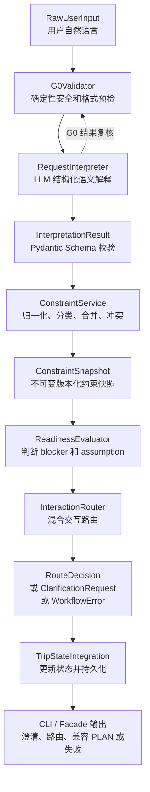

# M2 阶段技术解析：从自然语言到类型化交互决策

## 1. 文档定位

| 项目 | 内容 |
|:---|:---|
| 阶段 | M2：意图、约束、澄清与 Interaction Router |
| 阶段状态 | 已验收，2026-07-30 |
| 技术目标 | 将自然语言请求稳定转换为 `TripRequest`、`ConstraintSnapshot` 和 `RouteDecision` |
| 学习目标 | 理解 M2 使用的技术概念、数据流、代码职责、失败语义和测试方式 |
| 本阶段不做 | 外部工具、Evidence、Candidate、Task Graph、每日行程、Independent Critic、Targeted Repair、Action |

本文件依据以下资料编写：

- `docs/architecture/架构.md`：项目架构与业务边界参考；
- `docs/roadmap/M2-意图约束澄清与路由.md`：M2 阶段背景说明；
- `evaluation/reports/M2-completion.md`：M2 验收报告；
- `evaluation/reports/M2-handoff.md`：M2 交接报告；
- `docs/adr/ADR-002-m2-hybrid-routing-and-constraint-priority.md`：M2 混合路由与约束优先级决策。

> 当前实现限制：M2 只负责“用户要做什么、信息是否足够、下一步走哪条交互路径”，不负责验证实时旅行事实，也不负责生成可信的每日行程。`PLAN` 仍通过兼容 Facade 调用 legacy planner。

## 2. M2 要解决的工程问题

直接让 LLM 读取用户输入并生成答案，会产生以下问题：

1. 输出是自由文本，下游无法稳定判断字段是否存在；
2. 模型可能猜测缺失的日期、人数、预算或目的地；
3. Prompt Injection、危险动作和 PII 可能在模型调用前没有被阻断；
4. “不能爬山”和“最好少走路”这类 hard/soft 约束容易被混淆；
5. 约束冲突时，模型可能继续生成看似合理但不可执行的方案；
6. 信息不足时，模型可能默认进入 `PLAN`，而不是澄清；
7. 失败没有稳定的阶段、错误码和重试语义；
8. 单元测试只能比较自然语言，难以验证业务行为。

M2 的解决方式是采用“LLM 解释 + 确定性代码决策”的混合边界：

```text
LLM：提取意图、实体和约束候选
Pydantic：验证结构和字段
确定性服务：归一化、合并、冲突、就绪判断、状态转换
Router：根据安全、上下文和 blocker 决定下一步
```

## 3. M2 总体数据流



每一步都应产生类型化结果或显式失败，不能用自由文本作为系统判断的唯一输入。

## 4. M2 实现顺序与技术解析

### 4.1 第一步：LLMGateway Port 和 Fake

#### 技术概念

| 概念 | 含义 |
|:---|:---|
| Port | 应用层依赖的抽象接口，不暴露 DeepSeek SDK 细节 |
| Adapter | 将具体供应商 SDK 适配到 `LLMGateway` 接口 |
| Protocol | 使用结构化鸭子类型定义接口，便于真实实现和 Fake 替换 |
| Dependency Injection | 由组合根注入真实 Gateway 或 Fake，而不是在业务代码中自行创建 |
| Fake | 测试专用的显式 LLM 替身，未配置响应时必须失败 |
| Fail-fast | 配置、超时、调用和响应错误直接向上游传播，不自动补全 |

#### 当前实现

- [src/ports/llm_gateway.py](../../../src/ports/llm_gateway.py)：定义 `LLMGateway` Port；
- [src/gateway/deepseek_adapter.py](../../../src/gateway/deepseek_adapter.py)：将 DeepSeek 调用适配为 Port；
- [src/gateway/deepseek.py](../../../src/gateway/deepseek.py)：现有底层 LLM 调用、超时和响应处理；
- [tests/support/llm_fakes.py](../../../tests/support/llm_fakes.py)：提供显式 Fake；
- [tests/unit/test_llm_gateway_port.py](../../../tests/unit/test_llm_gateway_port.py)：验证接口、未配置响应和注入失败。

#### 如何使用

`RequestInterpreter` 只依赖 `LLMGateway`，不依赖 DeepSeek 的具体类：

```text
RequestInterpreter
    ↓ 依赖抽象
LLMGateway.complete(prompt, settings)
    ├─ DeepSeekLLMGateway：真实运行
    └─ FakeLLMGateway：离线测试
```

测试中必须显式注入 Fake。未注入 Fake、Fake 没有配置响应或 Fake 被耗尽时，测试应失败，不能返回默认 `PLAN`。

#### 该步骤解决的问题

将“模型供应商连接问题”和“业务解释逻辑”分开，使离线测试可以完全控制模型响应，同时保留真实 LLM Gate 验收入口。

---

### 4.2 第二步：`InterpretationResult` Schema

#### 技术概念

- **Pydantic v2**：使用类型声明、字段约束和模型校验保证跨层契约；
- **JSON Schema**：把模型输出限制为明确的字段、类型和枚举；
- **`extra="forbid"`**：拒绝模型生成的未知字段，避免下游静默忽略错误；
- **不可变模型**：解释结果和约束快照进入下游后不可原地修改；
- **置信度是信号而不是授权**：confidence 不能绕过代码校验、G0 或 blocker。

#### 当前实现

- [src/domain/models/interpretation.py](../../../src/domain/models/interpretation.py)：定义 `InterpretationResult`、`ExtractedEntity`、`ConstraintCandidate` 和安全标记；
- [src/domain/models/enums.py](../../../src/domain/models/enums.py)：定义交互模式、约束硬度、工作流状态等枚举；
- [tests/unit/test_interpretation_contracts.py](../../../tests/unit/test_interpretation_contracts.py)：验证缺字段、未知字段、非法枚举、置信度和不可变性；
- [src/gateway/json_utils.py](../../../src/gateway/json_utils.py)：将 LLM 文本解析为 JSON 对象。

#### 输出结构

```text
InterpretationResult
  mode_hint
  extracted_entities
  constraint_candidates
  explicit_questions
  references_to_current_plan
  field_confidence
  overall_confidence
  safety_flags
```

#### 如何使用

```text
LLM 原始文本
    ↓ parse_json_object
JSON object
    ↓ InterpretationResult.model_validate
InterpretationResult
    ↓
ConstraintService / ReadinessEvaluator / Router
```

解析失败、缺少必填字段、出现未知字段或枚举非法时，转换为 `WorkflowError`，不继续进入约束和路由阶段。

#### 该步骤解决的问题

把模型的非确定性输出限制在可验证契约内，使测试可以断言结构化行为，而不是比较完整自然语言。

---

### 4.3 第三步：G0 Validator

#### 技术概念

| 概念 | M2 中的作用 |
|:---|:---|
| Guardrail | 在 LLM 调用前阻断明显危险、越权或不安全输入 |
| Prompt Injection Detection | 识别“忽略之前指令、泄露系统提示词”等攻击文本 |
| PII Boundary | 用户文本可能包含 PII 时，只允许使用经过脱敏的引用或文本 |
| Security Context | 显式携带认证、授权和脱敏引用上下文 |
| Deterministic Validation | 对类型、长度、控制字符和明显非法日期使用代码判断 |

#### 当前实现

- [src/guard/g0.py](../../../src/guard/g0.py)：定义 `G0SecurityContext`、`G0Issue`、`G0ValidationResult` 和 `G0Validator`；
- [tests/unit/test_g0_validator.py](../../../tests/unit/test_g0_validator.py)：验证输入、认证、PII、危险动作和非法日期；
- [tests/unit/test_g0_prompt_injection_variants.py](../../../tests/unit/test_g0_prompt_injection_variants.py)：验证不同 Prompt Injection 表达；
- [tests/unit/test_request_interpreter_g0_regression.py](../../../tests/unit/test_request_interpreter_g0_regression.py)：验证 G0 阻断后 Gateway 调用次数为零。

#### 检查范围

```text
负责：类型、长度、控制字符、认证、授权、PII、危险动作、Prompt Injection、明显非法日期
不负责：完整意图理解、地名消歧、旅行事实核验、最终行程可行性
```

#### 如何使用

```text
raw_input + G0SecurityContext
    ↓ G0Validator.validate
G0ValidationResult
    ├─ passed=True：允许继续解释
    └─ passed=False：抛出 WorkflowError，禁止调用 LLM
```

G0 需要在真正的模型调用之前执行。`RequestInterpreter` 内部也会复验 G0 结果，避免绕过解释器直接调用 Gateway。

#### 该步骤解决的问题

将安全边界从 Prompt 中移到确定性代码中。尤其是 Prompt Injection 用例，必须修复 G0 规则，而不能修改用例文本来掩盖缺陷。

---

### 4.4 第四步：RequestInterpreter

#### 技术概念

- **结构化输出**：要求模型返回符合 `InterpretationResult` 的 JSON；
- **Prompt Data Boundary**：将用户文本作为不可信数据放入明确边界，不与系统指令混合；
- **模式白名单**：`allowed_modes` 限制解释器可以返回的工作模式；
- **错误分类**：配置错误、超时、LLM 错误、解析错误和 Schema 错误分开；
- **模型与确定性代码分工**：模型提取语义，代码决定是否接受结果。

#### 当前实现

- [src/agents/request_interpreter.py](../../../src/agents/request_interpreter.py)：完成 Prompt 构造、Gateway 调用、JSON 解析、Schema 校验、模式白名单和错误转换；
- [src/config.py](../../../src/config.py)：提供已校验的模型、超时、Token 和 strict 配置；
- [tests/unit/test_request_interpreter.py](../../../tests/unit/test_request_interpreter.py)：验证正常解释、数据边界、非法响应、G0 阻断、LLM 失败和 Fake 耗尽；
- [tests/unit/test_request_interpreter_edge_cases.py](../../../tests/unit/test_request_interpreter_edge_cases.py)：验证摘要、模式、响应类型和脱敏边界。

#### 输入与输出

```text
输入：
  raw_input
  conversation_summary
  current_state
  allowed_modes
  G0SecurityContext
  redacted_input

输出：
  InterpretationResult
```

#### 失败语义

以下情况统一阻断流程：

- G0 未通过；
- 会话摘要类型错误或超长；
- Gateway 配置错误、超时或调用异常；
- LLM 返回非文本、空响应或非法 JSON；
- 缺字段、额外字段或非法枚举；
- 返回不允许的 mode；
- LLM 漏掉 G0 已发现的安全标记。

不能做的事情：重试、默认填充、把失败结果变成 `PLAN`、用模型 confidence 绕过代码校验。

---

### 4.5 第五步：ConstraintService 与 Negation Guard

#### 技术概念

| 概念 | 含义 |
|:---|:---|
| Normalization | 将不同自然语言表达归一为日期、金额、人数、地点等领域值 |
| Constraint Hardness | 区分必须满足、偏好、假设和未知 |
| Provenance / Source Priority | 记录约束来自用户输入、用户确认、旅程假设还是画像建议 |
| Conflict Group | 将相互矛盾的约束归到同一冲突组 |
| Immutable Snapshot | 每次更新生成新快照，不原地修改旧快照 |
| Negation Recall | 从文本召回否定表达，作为语义解释的辅助信号 |

#### 当前实现

- [src/domain/services/constraint_service.py](../../../src/domain/services/constraint_service.py)：归一化、分类、合并、冲突检测和 Snapshot 生成；
- [src/domain/models/constraint.py](../../../src/domain/models/constraint.py)：定义 `Constraint`、`ConstraintSnapshot` 和来源类型；
- [src/domain/models/value_objects.py](../../../src/domain/models/value_objects.py)：定义 `Money`、`DateRange` 等领域值对象；
- [src/guard/negation.py](../../../src/guard/negation.py)：提取否定约束候选；
- [tests/unit/test_constraint_service.py](../../../tests/unit/test_constraint_service.py)：验证规范化、合并、来源优先级、Snapshot 和否定协作；
- [tests/unit/test_constraint_service_edge_cases.py](../../../tests/unit/test_constraint_service_edge_cases.py)：验证日期、货币、人数、地点和非法值；
- [tests/unit/test_constraint_service_branch_matrix.py](../../../tests/unit/test_constraint_service_branch_matrix.py)：验证值类型分派和边界分支；
- [tests/unit/test_negation_guard.py](../../../tests/unit/test_negation_guard.py)：验证否定提取、去重和空输入。

#### 来源优先级

```text
当前用户明确输入
    > 当前用户确认
    > 当前旅程假设
    > 画像建议
```

#### 约束分类示例

```text
“不能爬山”       → hard
“最好少走路”      → soft
“不是非要五星级”  → 不是禁止五星级，需结合语义判断
“除了周三都可以”  → 时间范围约束
“不要太贵，但酒店可以好一点” → 软预算 + 局部偏好
```

#### 如何使用

```text
InterpretationResult + previous_snapshot + negation_text
    ↓ ConstraintService.build_snapshot
ConstraintSnapshot(version=N+1)
    ├─ normalized_constraints
    ├─ source/provenance
    ├─ hardness
    ├─ conflict_groups
    └─ stable constraint IDs
```

Negation Guard 只能做召回特征，不能把所有否定结果直接标为 hard。最终分类必须结合结构化解释和领域规则。

#### 该步骤解决的问题

让下游看到稳定、可追踪和可比较的约束，而不是直接处理用户原话；同时保留历史 Snapshot，便于后续 M3～M7 使用版本和引用。

---

### 4.6 第六步：ReadinessEvaluator

#### 技术概念

- **Readiness Gate**：判断当前请求是否具备进入下一阶段的最小条件；
- **Blocker**：缺失或冲突到足以阻止下一步执行的问题；
- **Assumption**：非阻断的缺失信息，允许显式展示但不能伪装成事实；
- **Information Gain**：优先询问能最大程度解除阻断的问题；
- **Context-aware Validation**：结合当前模式、当前计划引用和安全上下文判断。

#### 当前实现

- [src/domain/services/readiness_evaluator.py](../../../src/domain/services/readiness_evaluator.py)：判断必填字段、日期/时长、人数、预算、hard 冲突、Action 前置条件和当前计划引用；
- [src/domain/models/readiness.py](../../../src/domain/models/readiness.py)：定义 blocker、assumption、Action 前置条件和 `ReadinessResult`；
- [tests/unit/test_readiness_evaluator.py](../../../tests/unit/test_readiness_evaluator.py)：验证完整请求、关键字段缺失、日期冲突、预算冲突、计划引用、授权和 assumption。

#### 进入 CLARIFY 的主要条件

```text
origin/destination 无法确定
日期或 duration 无法推导
人数或特殊人群影响安全/票务
预算语义冲突
hard constraint 自相矛盾
ACTION 缺少授权或身份前提
REFINE/REPLAN 缺少当前计划引用
```

#### 如何使用

```text
ConstraintSnapshot + InterpretationResult + 当前上下文
    ↓ ReadinessEvaluator.evaluate
ReadinessResult
    ├─ ready=True
    ├─ blockers
    ├─ assumptions
    └─ confidence
```

只有真正阻断规划的信息才进入 `blockers`。非阻断信息可以成为 `assumption`，但 assumption 不能替代后续 M3 的 API 查询失败。

---

### 4.7 第七步：ClarificationBuilder

#### 技术概念

- **结构化澄清请求**：问题不是自由文本拼接，而是带 ID、字段引用和问题类型的 DTO；
- **问题排序**：按阻断程度和信息增益排序；
- **数量上限**：一次最多三个问题，避免用户负担过重；
- **稳定问题 ID**：相同 blocker 在不同 Trace 中仍能得到稳定引用；
- **可解释映射**：每个问题必须对应具体字段或 conflict group。

#### 当前实现

- [src/domain/services/clarification_builder.py](../../../src/domain/services/clarification_builder.py)：将 `ReadinessResult.blockers` 转换为用户问题；
- [src/domain/models/clarification.py](../../../src/domain/models/clarification.py)：定义 `ClarificationQuestion` 和 `ClarificationRequest`；
- [tests/unit/test_clarification_builder.py](../../../tests/unit/test_clarification_builder.py)：验证排序、最多三个问题、blocker 引用、assumption 忽略和稳定 ID。

#### 数据流

```text
ReadinessResult.blockers
    ↓ 去重、排序、限量
ClarificationBuilder
    ↓ 模板化问题
ClarificationRequest.questions
    ↓
CLI 或未来 API 展示
```

澄清只解决当前阻断问题。用户补充后，系统只更新相关约束，再重新执行解释、归一化、就绪判断和路由。

---

### 4.8 第八步：InteractionRouter

#### 技术概念

| 概念 | M2 中的使用方式 |
|:---|:---|
| Hybrid Routing | 确定性优先级 + Interpreter 语义结果 + Readiness 结果 |
| RouteDecision | 用结构化 DTO 表达下一步模式和所需能力 |
| Reason Code | 用稳定枚举解释为什么选择该路由 |
| Capability Planning | 将下一阶段需要的能力作为 `required_capabilities` 输出 |
| Safety Precedence | G0 和权限优先于用户意图与其他路由 |

#### 当前实现

- [src/application/interaction_router.py](../../../src/application/interaction_router.py)：实现混合路由和优先级；
- [src/domain/models/routing.py](../../../src/domain/models/routing.py)：定义 `RouteDecision` 和路由原因码；
- [tests/unit/test_interaction_router.py](../../../tests/unit/test_interaction_router.py)：验证正常模式、G0 优先、blocker、当前计划和未知模式；
- [tests/unit/test_interaction_router_edge_cases.py](../../../tests/unit/test_interaction_router_edge_cases.py)：验证 REFINE、REPLAN、能力集合和边界模式。

#### 决策优先级

```text
1. G0 安全与权限
2. 显式 ACTION
3. 当前计划上的 REFINE / REPLAN
4. CLARIFY
5. ANSWER / COMPARE / PLAN
6. 无法可靠识别 → CLARIFY，不猜测
```

#### 输出结构

```text
RouteDecision
  mode
  confidence
  reason_codes
  required_capabilities
  missing_blockers
  risk_flags
  current_plan_ref
```

Router 不能简化为纯关键词 `if/else`，也不能完全交给 LLM。`mode_hint` 只是意图信号，不能绕过 blocker、权限和状态校验。

#### 该步骤解决的问题

让系统从“无论什么输入都生成答案”升级为“根据安全、上下文和就绪状态选择下一步动作”，并为 M3 的 Tool Adapter 读取 `required_capabilities` 提供稳定接口。

---

### 4.9 第九步：TripState 集成

#### 技术概念

- **有限状态机**：只允许白名单中的状态转换；
- **State Repository**：将状态存取抽象为 Port，当前使用 InMemory 实现；
- **版本控制**：状态和 Snapshot 版本递增，避免旧状态覆盖新状态；
- **Facade**：在应用边界串联多个领域服务，不把流程编排放进领域对象；
- **失败状态**：解析、Schema、配置或约束失败进入 `FAILED`，用户信息不足进入 `CLARIFYING`。

#### 当前实现

- [src/domain/models/state.py](../../../src/domain/models/state.py)：定义 `TripState`、工作流状态和合法转换；
- [src/application/trip_state_integration.py](../../../src/application/trip_state_integration.py)：根据 `RouteDecision` 驱动状态转换；
- [src/ports/state_repository.py](../../../src/ports/state_repository.py)：定义状态仓库接口；
- [src/infrastructure/persistence/in_memory.py](../../../src/infrastructure/persistence/in_memory.py)：当前内存实现；
- [src/application/interaction_facade.py](../../../src/application/interaction_facade.py)：串联完整 M2 流程并保存状态；
- [tests/unit/test_trip_state.py](../../../tests/unit/test_trip_state.py)：验证状态转换和版本；
- [tests/unit/test_trip_state_integration.py](../../../tests/unit/test_trip_state_integration.py)：验证路由到状态的集成。

#### 关键转换

```text
COLLECTING → CLARIFYING：存在 blocker
CLARIFYING → COLLECTING：用户补充后重新解释
COLLECTING → RESEARCHING：PLAN/COMPARE 且已就绪
解析/Schema/配置异常 → FAILED
```

M2 不允许直接进入 `DRAFTING`。当前 M2 只建立进入 M3/M4 的控制平面，不实现真正的 Research 或规划状态。

---

### 4.10 第十步：CLI / Facade 接入并保留现有 PLAN 行为

#### 技术概念

- **兼容 Facade**：在不破坏旧 CLI 的前提下接入新 M2 流程；
- **Use Case Boundary**：将 `PLAN` 结果包装成稳定应用层结果；
- **Legacy Migration**：旧 planner 暂时保留，但新入口通过 Facade 调用；
- **Presentation Boundary**：CLI 负责展示，不负责约束判断、预算计算或路由。

#### 当前实现

- [main.py](../../../main.py)：读取 CLI 输入、构造最小 `TripRequest`、展示路由/澄清/规划结果；
- [src/application/interaction_facade.py](../../../src/application/interaction_facade.py)：先执行 M2 交互流程，`PLAN` 时调用 planner；
- [src/application/use_cases/plan_trip.py](../../../src/application/use_cases/plan_trip.py)：将结构化请求渲染为 legacy planner 输入，并映射为 `PlanTripResult`；
- [src/engine/loop.py](../../../src/engine/loop.py)：旧版 `LLM-A → L1 → LLM-B → 有界修订`；
- [src/legacy/mapper.py](../../../src/legacy/mapper.py)：验证并映射旧 planner 结果；
- [tests/unit/test_interaction_facade.py](../../../tests/unit/test_interaction_facade.py)：验证 M2 路由、澄清和失败状态；
- [tests/unit/test_plan_trip_facade.py](../../../tests/unit/test_plan_trip_facade.py)：验证旧 PLAN 兼容和失败映射；
- [tests/e2e/test_cli.py](../../../tests/e2e/test_cli.py)：验证 CLI 输入、输出和异常退出码。

#### PLAN 路径

```text
RouteDecision(mode=PLAN)
    ↓
PlanTripUseCase
    ↓ render_legacy_request
legacy planner
    ↓
LLM-A 生成
    ↓
L1 确定性检查
    ↓
LLM-B 评审
    ↓
有限整份修订
    ↓
PlanTripResult
```

这条链路是 M2 的兼容行为，不代表 M2 已完成 M3～M5。它仍然没有 Tool、Evidence、Candidate、Task Graph、G0～G5 统一 Gate 或结构化 Repair。

## 5. M2 的失败语义

### 5.1 `CLARIFY` 与 `FAILED` 的区别

| 场景 | 结果 | 原因 |
|:---|:---|:---|
| 用户未说明人数，其他信息可继续理解 | `CLARIFYING` | 用户信息不足，可以通过补充解决 |
| 日期和时长语义冲突 | `CLARIFYING` 或结构化冲突 | 需要用户选择或确认 |
| LLM 返回非法 JSON | `FAILED` | 系统无法信任解释结果 |
| Pydantic Schema 校验失败 | `FAILED` | 契约不满足 |
| LLM 超时或配置缺失 | `FAILED` | 外部依赖或配置失败 |
| ConstraintService 无法归一化值 | `FAILED` | 确定性领域处理失败 |
| Router 无法可靠识别模式 | `FAILED` 或 `CLARIFY` | 不能猜测下一步 |
| Prompt Injection 被 G0 识别 | `FAILED` 或安全边界说明 | 不得调用模型或继续规划 |

### 5.2 M2 错误代码

至少包含：

```text
INPUT_EMPTY
INPUT_TOO_LONG
INTERPRETATION_INVALID
CONSTRAINT_CONFLICT
MISSING_BLOCKER
ROUTE_UNCERTAIN
PLAN_CONTEXT_MISSING
```

错误至少保留：

```text
trace_id
stage
category
code
safe_message
retryable
cause_type
upstream_refs
```

### 5.3 明确禁止的错误处理

- 不把非法 JSON 变成默认 `PLAN`；
- 不用估算日期、价格或人数填空；
- 不在 M2 自动重试或切换供应商；
- 不把约束归一化失败包装成空结果；
- 不把达到调用上限视为成功；
- 不因为 CLI 需要输出就强行生成部分方案。

## 6. M2 的测试技术

### 6.1 Contract Test

验证模型、错误和状态契约，而不是只验证“返回了内容”：

- Pydantic 缺字段、未知字段、非法枚举；
- Snapshot 不可变和版本递增；
- State 转换白名单；
- RouteDecision 字段完整；
- WorkflowError 阶段和错误码精确。

### 6.2 Offline Suite

默认零网络，显式注入 Fake，覆盖：

- 非法 JSON、空响应、字段缺失、额外字段；
- Gateway 超时、配置错误、响应解析失败；
- Prompt Injection 和 PII 脱敏；
- 日期、货币、人数、地点归一化；
- hard/soft/assumption/unknown；
- 否定、局部否定、范围否定和冲突；
- 澄清最多三个且只问 blocker；
- 未知 mode 不默认 `PLAN`；
- 状态版本冲突和失败状态；
- 无 fallback、cache、retry、partial success。

相关测试目录：

- `tests/unit/test_llm_gateway_port.py`；
- `tests/unit/test_interpretation_contracts.py`；
- `tests/unit/test_g0_validator.py`；
- `tests/unit/test_request_interpreter*.py`；
- `tests/unit/test_constraint_service*.py`；
- `tests/unit/test_readiness_evaluator.py`；
- `tests/unit/test_clarification_builder.py`；
- `tests/unit/test_interaction_router*.py`；
- `tests/unit/test_trip_state*.py`。

### 6.3 Live LLM Gate

M2 的真实模型验收使用固定配置：

```text
model: deepseek-v4-flash
Prompt version: m2-request-interpreter-v2
Schema version: 1.0
cases: 9
runs: 18
network calls: 14
retry_count: 0
```

只断言结构化指标：

- Schema 通过率；
- 关键字段召回；
- hard/soft 分类；
- 否定约束召回；
- 澄清 blocker 精度；
- 安全标记正确性。

不把完整自然语言是否“写得好”作为 M2 Interpreter Gate 的主要指标。

报告：[evaluation/reports/M2-live-interpreter.json](../../../evaluation/reports/M2-live-interpreter.json)。

## 7. M2 中各技术的边界

| 技术 | M2 使用到的范围 | M2 明确不负责 |
|:---|:---|:---|
| Pydantic v2 | DTO、Schema、状态、错误、值对象 | 完整计划交付 Schema |
| LLM Gateway | 解释用户意图和约束候选 | 直接决定权限、状态和路由 |
| JSON Schema | 约束 Interpreter 输出 | 验证实时旅行事实 |
| G0 | 输入安全、权限、PII、注入和格式 | 地名消歧、事实核验 |
| ConstraintService | 归一化、分类、合并、冲突、Snapshot | 交通、酒店、活动查询 |
| ReadinessEvaluator | 判断是否需要澄清 | 生成每日行程 |
| ClarificationBuilder | 生成最少必要问题 | 主动追问非阻断偏好 |
| InteractionRouter | 选择交互模式和能力 | 调度 M4 Agent |
| TripState | 保存 M2 会话状态和版本 | SQLite、事件驱动重规划 |
| legacy planner | 保留旧 PLAN 回归行为 | M5 结构化 Critic/Repair |

## 8. M2 给后续阶段留下的接口

M3 可以直接消费：

```text
InterpretationResult
ConstraintSnapshot
RouteDecision.required_capabilities
RouteDecision.current_plan_ref
TripState
WorkflowError
```

M3 必须继续遵守：

- 不绕过 G0、ConstraintService、ReadinessEvaluator 和 Router；
- 只根据 `required_capabilities` 装配工具能力；
- 实时事实必须进入 Evidence，不能写回 `InterpretationResult`；
- 工具失败必须显式失败，不返回空成功；
- M2 的 `PLAN` 不等于 M3 已经接入真实工具。

## 9. 学习与复盘清单

完成 M2 学习后，应能回答：

1. 为什么不能直接让 LLM 输出最终路由？
2. 为什么 G0 必须在 LLM 调用前执行？
3. `InterpretationResult`、`ConstraintSnapshot` 和 `RouteDecision` 的职责如何区分？
4. 为什么模型 confidence 不能绕过代码校验？
5. hard、soft、assumption、unknown 分别如何影响后续流程？
6. Negation Guard 为什么只能做召回特征？
7. 什么是 blocker，什么是 assumption？
8. 为什么澄清问题最多三个？
9. Router 为什么既不能纯关键词实现，也不能完全交给 LLM？
10. 非法 JSON 为什么必须 `FAILED`，而不是默认 `PLAN`？
11. `CLARIFYING` 和 `FAILED` 的状态语义有什么区别？
12. Fake 测试通过为什么不能替代 Live LLM Gate？
13. M2 为什么不调用地图、酒店、航班和天气 API？
14. M2 输出如何被 M3 的 Tool Adapter、Evidence Registry 和 Candidate Pool 使用？
15. 当前 legacy planner 与未来 M4/M5 的规划链有什么区别？

## 10. 阶段结论

M2 的核心成果不是“生成了一份旅行规划”，而是建立了一条可控的请求入口：

```text
不可信自然语言
  → 安全预检
  → 类型化语义解释
  → 约束快照
  → 就绪判断
  → 澄清或混合路由
  → 可版本化状态
```

这条控制平面是 M3 工具与证据、M4 Task Graph 与 Research Agent、M5 Gate/Critic/Repair 的前置基础。M2 完成后，系统仍然不能声称具备可信实时旅行规划能力；该能力需要后续阶段逐步实现并验收。
